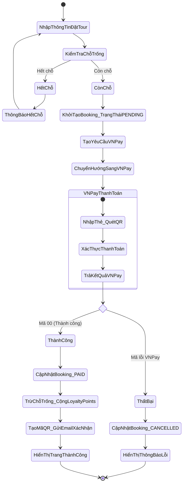
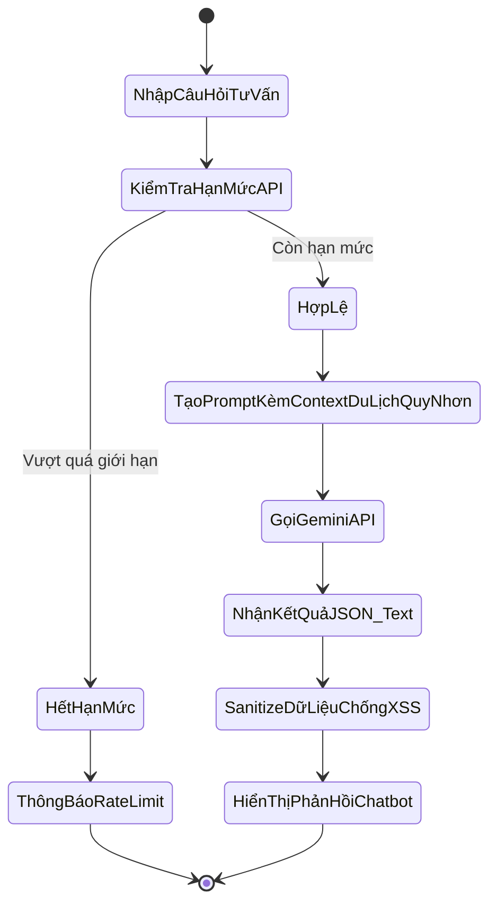
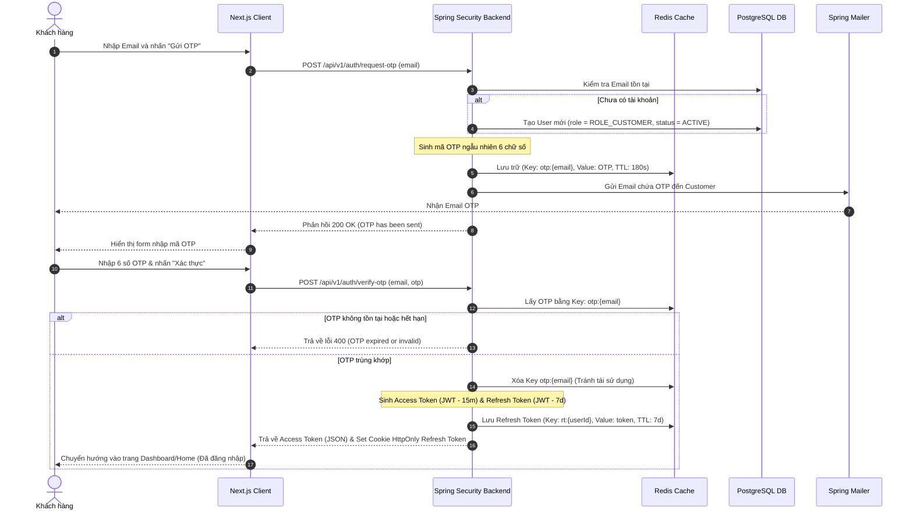
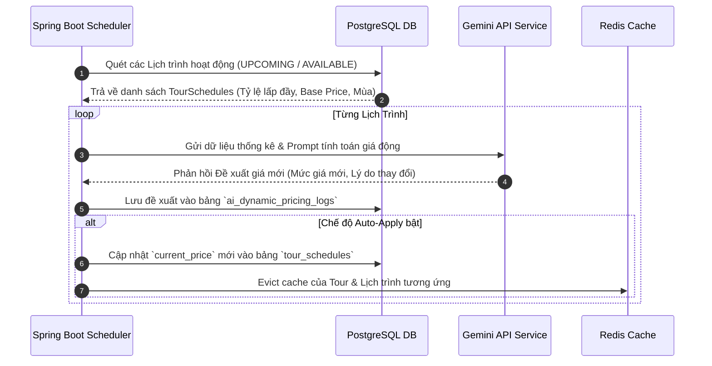
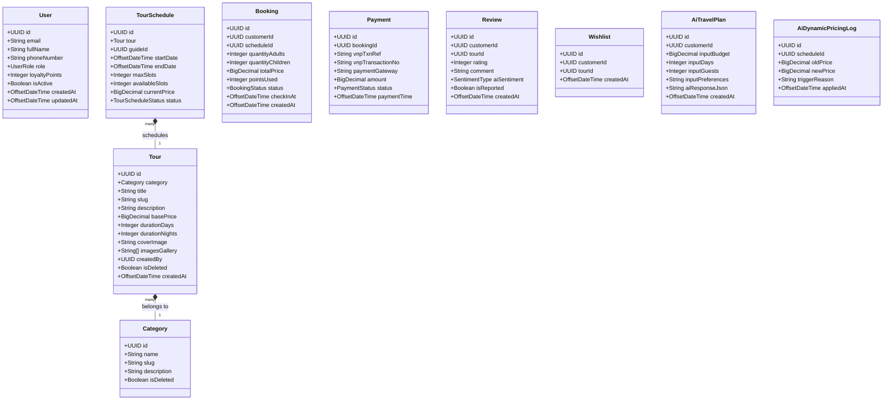
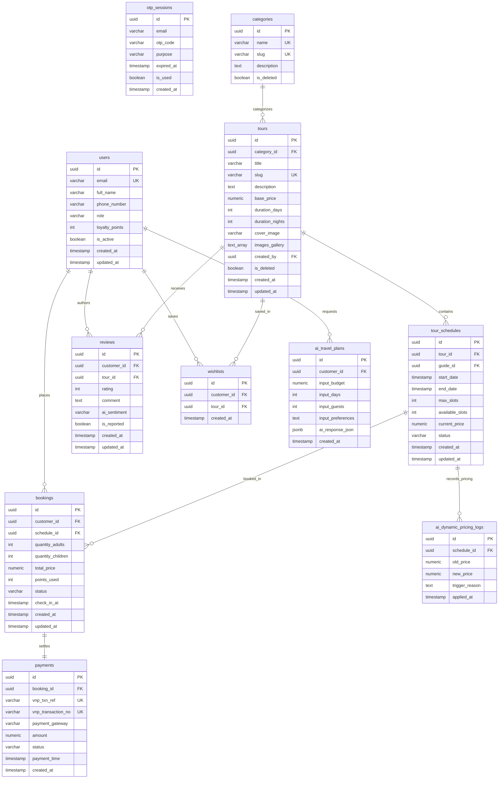

# TÀI LIỆU PHÂN TÍCH VÀ THIẾT KẾ HỆ THỐNG
## HỆ THỐNG QUẢN LÝ VÀ ĐẶT TOUR DU LỊCH QUY NHƠN TÍCH HỢP AI (AI-POWERED QUY NHON TOURISM MANAGEMENT SYSTEM)

---

### MỤC LỤC
1. [Business Requirements (Yêu cầu Nghiệp vụ)](#1-business-requirements)
2. [Functional Requirements (Yêu cầu Chức năng)](#2-functional-requirements)
3. [Non-Functional Requirements (Yêu cầu Phi chức năng)](#3-non-functional-requirements)
4. [User Stories (Kịch bản Người dùng)](#4-user-stories)
5. [Use Case Diagram (Biểu đồ Ca sử dụng)](#5-use-case-diagram)
6. [Use Case Description (Mô tả Ca sử dụng)](#6-use-case-description)
7. [Activity Diagram (Biểu đồ Hoạt động)](#7-activity-diagram)
8. [Sequence Diagram (Biểu đồ Tuần tự)](#8-sequence-diagram)
9. [Class Diagram (Biểu đồ Lớp)](#9-class-diagram)
10. [ERD (Biểu đồ Quan hệ Thực thể)](#10-erd)
11. [Database Design (Thiết kế Cơ sở Dữ liệu)](#11-database-design)
12. [Backend Architecture - Spring Boot (Kiến trúc Backend)](#12-backend-architecture)
13. [Frontend Architecture - Next.js (Kiến trúc Frontend)](#13-frontend-architecture)
14. [JWT + Email OTP Authentication Flow (Luồng Xác thực)](#14-jwt--email-otp-authentication-flow)
15. [AI Module Architecture (Kiến trúc Module AI - 6 Tính năng)](#15-ai-module-architecture)
16. [REST API Design (Thiết kế API)](#16-rest-api-design)
17. [Folder Structure (Cấu trúc Thư mục Dự án)](#17-folder-structure)
18. [Redis Caching Strategy (Chiến lược Cache với Redis)](#18-redis-caching-strategy)
19. [Security Design (Thiết kế Bảo mật)](#19-security-design)
20. [Docker Deployment (Cấu hình Docker)](#20-docker-deployment)
21. [CI/CD Design (Thiết kế Tích hợp & Triển khai liên tục)](#21-cicd-design)
22. [Sprint Planning (Kế hoạch Phát triển Sprint)](#22-sprint-planning)
23. [Test Cases (Kịch bản Kiểm thử)](#23-test-cases)
24. [CV Description (Mô tả Dự án cho Hồ sơ xin việc)](#24-cv-description)
25. [Interview Questions and Answers (Câu hỏi Phỏng vấn & Trả lời)](#25-interview-questions-and-answers)

---

## 1. Business Requirements

### 1.1. Bối cảnh và Mục tiêu dự án
Quy Nhơn là điểm du lịch phát triển nhanh chóng tại Việt Nam với các danh thắng nổi tiếng như Kỳ Co, Eo Gió, Cù Lao Xanh. Để hỗ trợ các công ty du lịch địa phương chuyển đổi số, dự án **AI-Powered Quy Nhon Tourism Management System** hướng tới xây dựng một nền tảng du lịch thông minh, tối ưu hóa quy trình vận hành và ứng dụng Generative AI để cá nhân hóa hành trình của du khách.

### 1.2. Khách hàng mục tiêu (Target Audience)
*   **Khách du lịch tự túc:** Muốn tự lên lịch trình thông minh dựa trên sở thích cá nhân và ngân sách.
*   **Khách du lịch theo nhóm/gia đình:** Tìm kiếm các tour trọn gói tối ưu chi phí và thời gian.
*   **Doanh nghiệp lữ hành (Công ty vận hành):** Đội ngũ Admin, Manager, Staff quản lý tour, khách hàng và doanh thu.
*   **Hướng dẫn viên du lịch (Tour Guides):** Sử dụng thiết bị di động để nhận tour và quét QR Code check-in hành khách tại hiện trường.

### 1.3. Đề xuất Giá trị Cốt lõi (Value Propositions)
*   **AI-Driven Personalization:** Lên kế hoạch du lịch tự động trong 30 giây bằng Gemini API (AI Travel Planner & AI Chatbot).
*   **Tối ưu hóa hoạt động doanh nghiệp:** Đề xuất giá động (AI Dynamic Pricing), tự động hóa viết nội dung quảng bá tour (AI Content Generator) và đánh giá dịch vụ dựa trên cảm xúc khách hàng (AI Review Analyzer).
*   **Real-time Operations:** Tích hợp Check-in QR Code cho Hướng dẫn viên du lịch và thông báo Email tự động (Xác nhận đặt tour, nhắc lịch khởi hành).

---

## 2. Functional Requirements

Hệ thống phân quyền chi tiết với 5 vai trò (Roles) chính:

| Vai trò | Phân quyền & Chức năng cốt lõi |
| :--- | :--- |
| **Customer** | - Đăng ký, đăng nhập bằng Email OTP.<br>- Tìm kiếm, lọc tour (địa điểm, giá cả, thời gian, loại tour).<br>- Lưu tour yêu thích (Wishlist).<br>- Đặt tour và thanh toán trực tuyến qua cổng VNPay.<br>- Xem lịch sử đặt tour, đánh giá chất lượng tour (Reviews).<br>- Nhận gợi ý tour thông minh bằng AI (AI Tour Recommendation).<br>- Sử dụng AI Planner lên lịch trình du lịch Quy Nhơn tự động.<br>- Trò chuyện với AI Chatbot để nhận tư vấn du lịch Quy Nhơn. |
| **Tour Guide** | - Đăng nhập tài khoản nội bộ.<br>- Xem danh sách tour được phân công điều hành.<br>- Quản lý danh sách hành khách chi tiết.<br>- Thực hiện quét QR Code để Check-in khách tại điểm tập kết.<br>- Cập nhật trạng thái tour (AVAILABLE, FULL, DEPARTED, CANCELLED). |
| **Staff** | - Kiểm tra, phê duyệt hoặc cập nhật trạng thái Booking (PENDING_PAYMENT, PAID, CANCELLED, COMPLETED).<br>- Đổi lịch trình, hủy tour hoặc hỗ trợ đổi lịch cho khách.<br>- Quản lý hồ sơ thông tin khách hàng.<br>- Phản hồi các yêu cầu trợ giúp từ khách hàng. |
| **Manager** | - CRUD Quản lý thông tin Tour, Danh mục tour, Lịch trình tour.<br>- Quản lý nhân sự Staff và phân công Tour Guide.<br>- Xem dashboard thống kê doanh thu theo tuần/tháng/năm.<br>- Xem báo cáo phản hồi khách hàng thông qua phân tích cảm xúc đánh giá bằng AI (AI Review Analyzer).<br>- Quản lý cấu hình giá động đề xuất bởi hệ thống AI. |
| **Admin** | - Quản lý toàn bộ danh mục tài khoản người dùng và phân quyền (Role-based Access Control).<br>- Cấu hình tham số hệ thống: tham số kết nối VNPay, hạn mức API Gemini, thiết lập Redis TTL.<br>- Quản lý và xử lý tranh chấp giao dịch thanh toán và hoàn tiền (Refund).<br>- Kiểm duyệt các đánh giá bị báo cáo vi phạm (Reported Reviews). |

---

## 3. Non-Functional Requirements

### 3.1. Hiệu năng (Performance)
*   **Thời gian phản hồi (Response Time):** Các API thông thường phải phản hồi dưới 300ms. Đối với các API xử lý AI (Gemini), thời gian trả kết quả dưới 2.5s (sử dụng caching hoặc streaming).
*   **Khả năng chịu tải (Throughput):** Hệ thống đáp ứng tối thiểu 1,000 requests/second (RPS) đồng thời.
*   **Caching:** 90% các truy vấn lấy danh sách Tour tĩnh hoặc thông tin chi tiết Tour phải được phục vụ trực tiếp từ Redis Cache để giảm tải cho PostgreSQL.

### 3.2. Tính sẵn sàng & Khả năng mở rộng (Availability & Scalability)
*   Hệ thống duy trì độ sẵn sàng **SLA 99.9%**.
*   **Scalability:** Thiết kế stateless cho cả Backend và Frontend, cho phép scale-out dễ dàng bằng cách tăng số lượng Docker Container phía sau Nginx Load Balancer.

### 3.3. Bảo mật (Security)
*   Mã hóa mật khẩu người dùng nội bộ bằng thuật toán **BCrypt** (strength = 12).
*   Truy cập API được bảo vệ bằng cơ chế **JWT (JSON Web Token)** (Access Token trong bộ nhớ ngắn hạn, Refresh Token lưu trong HttpOnly Cookie).
*   Chống các lỗ hổng OWASP Top 10: SQL Injection (sử dụng Hibernate Parameterized Queries), XSS (sử dụng Next.js auto-escaping và JSoup sanitizer trên backend), CSRF (sử dụng Cookie SameSite).

---

## 4. User Stories

### US-01: Lên lịch trình du lịch thông minh bằng AI
*   **As a** Khách du lịch tự túc
*   **I want to** nhập ngân sách dự kiến, số ngày đi, số lượng người và sở thích cá nhân để AI tạo cho tôi một lịch trình tour Quy Nhơn hoàn chỉnh.
*   **Acceptance Criteria:**
    1. Hệ thống hiển thị form nhập thông tin trực quan.
    2. Khi nhấn nút "Tạo lịch trình", hệ thống gửi yêu cầu đến Gemini API kèm prompt được thiết lập sẵn.
    3. Kết quả trả về gồm danh sách các ngày với chi tiết địa điểm tham quan sáng/chiều/tối, ước tính chi phí, và các tour hiện có trên hệ thống phù hợp với lịch trình này.

### US-02: Đề xuất tour thông minh bằng AI (AI Tour Recommendation)
*   **As a** Khách hàng đã đăng nhập
*   **I want to** xem danh sách các tour gợi ý riêng cho tôi ở trang chủ để tối ưu hóa việc tìm kiếm tour phù hợp.
*   **Acceptance Criteria:**
    1. Hệ thống tự động thu thập thông tin về lịch sử xem tour, lịch sử đặt tour, ngân sách ưa thích và các đánh giá trước đó của tôi.
    2. Gửi dữ liệu này đến Gemini API để nhận diện sở thích và trả về danh sách Tour ID phù hợp nhất.
    3. Trang chủ hiển thị khu vực "Gợi ý dành riêng cho bạn" với danh sách các tour tương ứng.

### US-03: Kiểm tra thông tin hành khách bằng QR Code
*   **As a** Hướng dẫn viên du lịch
*   **I want to** quét mã QR Code trên vé của khách hàng bằng camera điện thoại để check-in họ vào đoàn.
*   **Acceptance Criteria:**
    1. Khi khách đặt tour thành công, hệ thống gửi email kèm QR Code chứa booking code đã mã hóa.
    2. Hướng dẫn viên quét mã QR. Ứng dụng gọi đến API `/api/v1/tour-guide/checkin` gửi kèm chuỗi mã QR.
    3. Hệ thống xác nhận trạng thái booking hợp lệ, chuyển trạng thái khách thành "Đã Check-in" và phản hồi thông tin hành khách (Tên, SĐT, Số lượng vé) lên màn hình.

### US-04: AI Dynamic Pricing (Đề xuất giá động)
*   **As a** Manager
*   **I want to** nhận được đề xuất điều chỉnh giá bán thực tế của các lịch trình tour dựa trên phân tích cung cầu từ AI để tối đa hóa doanh thu.
*   **Acceptance Criteria:**
    1. Hệ thống chạy Job quét các lịch khởi hành sắp tới, tính toán tỷ lệ lấp đầy (occupancy rate) và mùa du lịch hiện tại.
    2. AI phân tích và đề xuất điều chỉnh giá bán (tăng/giảm %) kèm theo lý do cụ thể.
    3. Manager phê duyệt đề xuất trên Dashboard, hệ thống tự động cập nhật giá mới (`current_price`) vào bảng `tour_schedules`.

### US-05: Lưu tour yêu thích (Wishlist)
*   **As a** Khách hàng
*   **I want to** nhấn nút yêu thích để lưu lại các tour tôi quan tâm vào danh sách yêu thích.
*   **Acceptance Criteria:**
    1. Khách hàng có thể click biểu tượng trái tim trên Tour Card.
    2. Hệ thống lưu liên kết giữa User và Tour vào bảng `wishlists`.
    3. Khách hàng có thể xem lại toàn bộ các tour đã lưu trong màn hình Dashboard cá nhân.

### US-06: Đăng nhập bằng Email OTP (Passwordless)
*   **As a** Khách hàng
*   **I want to** đăng nhập bằng cách nhận mã OTP qua email để không cần phải ghi nhớ mật khẩu.
*   **Acceptance Criteria:**
    1. Khách hàng nhập email vào màn hình đăng nhập.
    2. Hệ thống gửi mã OTP 6 chữ số vào email của khách hàng, đồng thời mã này được lưu vào Redis với TTL là 3 phút.
    3. Khách hàng nhập đúng mã OTP sẽ đăng nhập thành công và nhận được JWT tokens.

---

## 5. Use Case Diagram

```mermaid
rect User Interface
  classDef actor fill:#f9f,stroke:#333,stroke-width:2px;
  classDef usecase fill:#bbf,stroke:#333,stroke-width:1px;
end

graph TD
  Customer((Customer)):::actor
  TourGuide((Tour Guide)):::actor
  Staff((Staff)):::actor
  Manager((Manager)):::actor
  Admin((Admin)):::actor

  %% Customer Use Cases
  Customer --> UC_Auth[Đăng ký/Đăng nhập OTP]:::usecase
  Customer --> UC_SearchTour[Tìm kiếm & Lọc Tour]:::usecase
  Customer --> UC_Wishlist[Lưu Tour Yêu Thích]:::usecase
  Customer --> UC_BookTour[Đặt Tour & Thanh toán VNPay]:::usecase
  Customer --> UC_AIPlanner[Sử dụng AI Travel Planner]:::usecase
  Customer --> UC_AIChatbot[Trò chuyện AI Chatbot]:::usecase
  Customer --> UC_AIRecommend[Nhận gợi ý Tour từ AI]:::usecase
  Customer --> UC_Review[Đánh giá & Bình luận Tour]:::usecase

  %% Tour Guide Use Cases
  TourGuide --> UC_ViewAssigned[Xem lịch Tour phân công]:::usecase
  TourGuide --> UC_QRCodeCheckin[Check-in khách bằng QR Code]:::usecase
  TourGuide --> UC_UpdateTourStatus[Cập nhật trạng thái Tour]:::usecase

  %% Staff Use Cases
  Staff --> UC_ManageBooking[Quản lý Booking & Trạng thái]:::usecase
  Staff --> UC_CustomerSupport[Hỗ trợ khách hàng]:::usecase

  %% Manager Use Cases
  Manager --> UC_CRUDTour[Quản lý Tour & Lịch Trình]:::usecase
  Manager --> UC_Report[Xem Báo cáo Doanh thu & AI Sentiment]:::usecase
  Manager --> UC_DynamicPricing[Duyệt Giá Động đề xuất bởi AI]:::usecase

  %% Admin Use Cases
  Admin --> UC_ManageUser[Quản lý Phân quyền Người dùng]:::usecase
  Admin --> UC_ConfigSystem[Cấu hình Tham số AI & VNPay]:::usecase
  Admin --> UC_ReportReview[Xử lý Review bị báo cáo vi phạm]:::usecase

  %% Inheritances
  Manager -.-> |includes| Staff
  Admin -.-> |includes| Manager
```

---

## 6. Use Case Description

### 6.1. UC_BookTour: Đặt Tour và Thanh toán Trực tuyến
*   **Tác nhân chính:** Customer
*   **Tác nhân hỗ trợ:** VNPay Gateway, Email Service
*   **Tiền điều kiện:** Khách hàng đã đăng nhập và đang xem chi tiết lịch khởi hành (`tour_schedules`) còn chỗ trống.
*   **Luồng sự kiện chính (Basic Flow):**
    1. Khách hàng chọn số lượng người lớn, trẻ em và nhấn "Đặt Tour".
    2. Hệ thống kiểm tra số lượng chỗ trống. Nếu còn đủ chỗ, tính tổng tiền thực tế (đã áp dụng Dynamic Pricing & giảm trừ Loyalty Points nếu có).
    3. Hệ thống tạo bản ghi Booking ở trạng thái `PENDING_PAYMENT` và sinh URL thanh toán VNPay.
    4. Hệ thống chuyển hướng khách hàng sang cổng thanh toán VNPay.
    5. Khách hàng thực hiện thanh toán thành công. VNPay gọi webhook IPN về backend của hệ thống.
    6. Hệ thống xác nhận giao dịch thành công, cập nhật trạng thái Booking sang `PAID`, trừ số ghế trống trên `tour_schedules`, cộng điểm tích lũy (loyalty points) cho khách hàng.
    7. Hệ thống tạo mã QR Code check-in duy nhất và gửi email xác nhận đặt chỗ kèm QR Code cho khách hàng.
*   **Luồng rẽ nhánh (Alternative Flow):**
    *   *Mã lỗi từ VNPay:* Cập nhật trạng thái Booking thành `CANCELLED`, gửi email thông báo thanh toán thất bại và khôi phục số ghế (nếu đã tạm giữ).

### 6.2. UC_AIPlanner: Sử dụng AI Travel Planner
*   **Tác nhân chính:** Customer
*   **Luồng sự kiện chính (Basic Flow):**
    1. Khách hàng nhập thông tin: Ngân sách, Số ngày, Số người, Sở thích cá nhân.
    2. Hệ thống kiểm tra trong Redis Cache xem đã có kế hoạch tương tự chưa. Nếu có (Cache Hit), hiển thị ngay kết quả.
    3. Nếu không có (Cache Miss), hệ thống gửi prompt chuẩn hóa đến Gemini API.
    4. Gemini API phân tích và trả về cấu trúc JSON chứa lịch trình chi tiết (Sáng/Chiều/Tối của từng ngày).
    5. Hệ thống lưu kết quả vào bảng `ai_travel_plans` và Redis Cache, đồng thời hiển thị lịch trình lên giao diện cho khách hàng.

---

## 7. Activity Diagram

### 7.1. Quy trình Đặt Tour và Thanh toán VNPay


### 7.2. Quy trình Hoạt động của AI Travel Chatbot


---

## 8. Sequence Diagram

### 8.1. Luồng Xác thực không mật khẩu (Email OTP Passwordless)


### 8.2. Luồng AI Dynamic Pricing (Cập nhật giá động tự động)


---

## 9. Class Diagram



---

## 10. ERD (Entity-Relationship Diagram)



---

## 11. Database Design

Hệ thống sử dụng cơ sở dữ liệu quan hệ **PostgreSQL**. Dưới đây là đặc tả chi tiết của các bảng chính:

### 11.1. Bảng `users` (Thông tin người dùng)
*   `id` (UUID, Primary Key, Mặc định sinh `gen_random_uuid()`)
*   `email` (VARCHAR(150), Unique, Not Null)
*   `full_name` (VARCHAR(100), Not Null)
*   `phone_number` (VARCHAR(15))
*   `role` (VARCHAR(20), Not Null) - Các giá trị: `ROLE_ADMIN`, `ROLE_MANAGER`, `ROLE_STAFF`, `ROLE_GUIDE`, `ROLE_CUSTOMER`.
*   `loyalty_points` (INT, Default 0, Ràng buộc >= 0)
*   `is_active` (BOOLEAN, Default True)
*   `created_at` / `updated_at` (TIMESTAMP WITH TIME ZONE)

### 11.2. Bảng `tours` (Thông tin tour du lịch)
*   `id` (UUID, Primary Key)
*   `category_id` (UUID, Foreign Key references `categories(id)`)
*   `title` (VARCHAR(255), Not Null)
*   `slug` (VARCHAR(255), Unique, Not Null)
*   `description` (TEXT, Not Null)
*   `base_price` (NUMERIC(12,2), Not Null, Ràng buộc > 0)
*   `duration_days` (INT, Not Null, Ràng buộc > 0)
*   `duration_nights` (INT, Not Null, Ràng buộc >= 0)
*   `cover_image` (VARCHAR(255))
*   `images_gallery` (TEXT[]) - Mảng lưu trữ danh sách ảnh phụ.
*   `created_by` (UUID, Foreign Key references `users(id)`)
*   `is_deleted` (BOOLEAN, Default False)

### 11.3. Bảng `tour_schedules` (Lịch trình khởi hành chi tiết)
*   `id` (UUID, Primary Key)
*   `tour_id` (UUID, Foreign Key references `tours(id)`)
*   `guide_id` (UUID, Foreign Key references `users(id)`)
*   `start_date` / `end_date` (TIMESTAMP WITH TIME ZONE, Not Null, `end_date` > `start_date`)
*   `max_slots` (INT, Not Null, > 0)
*   `available_slots` (INT, Not Null, 0 <= `available_slots` <= `max_slots`)
*   `current_price` (NUMERIC(12,2), Not Null) - Giá thực tế của lịch trình (sau khi áp dụng thuật toán Dynamic Pricing).
*   `status` (VARCHAR(20), Default 'AVAILABLE') - Các giá trị: `AVAILABLE`, `FULL`, `DEPARTED`, `CANCELLED`.

### 11.4. Bảng `bookings` (Thông tin đặt tour)
*   `id` (UUID, Primary Key)
*   `customer_id` (UUID, Foreign Key references `users(id)`)
*   `schedule_id` (UUID, Foreign Key references `tour_schedules(id)`)
*   `quantity_adults` (INT, Not Null, Default 1, >= 1)
*   `quantity_children` (INT, Default 0, >= 0)
*   `total_price` (NUMERIC(12,2), Not Null)
*   `points_used` (INT, Default 0)
*   `status` (VARCHAR(30), Default 'PENDING_PAYMENT') - Các giá trị: `PENDING_PAYMENT`, `PAID`, `CANCELLED`, `COMPLETED`.
*   `check_in_at` (TIMESTAMP WITH TIME ZONE)

### 11.5. Bảng `wishlists` (Tour yêu thích)
*   `id` (UUID, Primary Key)
*   `customer_id` (UUID, Foreign Key references `users(id)`, Not Null)
*   `tour_id` (UUID, Foreign Key references `tours(id)`, Not Null)
*   `created_at` (TIMESTAMP WITH TIME ZONE, Default CURRENT_TIMESTAMP)
*   *Constraint:* Unique Composite Index trên (`customer_id`, `tour_id`).

### 11.6. Bảng `reviews` (Đánh giá chất lượng dịch vụ)
*   `id` (UUID, Primary Key)
*   `customer_id` (UUID, Foreign Key references `users(id)`)
*   `tour_id` (UUID, Foreign Key references `tours(id)`)
*   `rating` (INT, Ràng buộc từ 1 đến 5)
*   `comment` (TEXT)
*   `ai_sentiment` (VARCHAR(20)) - Các giá trị: `POSITIVE`, `NEUTRAL`, `NEGATIVE`.
*   `is_reported` (BOOLEAN, Default False) - Đánh dấu nếu bị báo cáo vi phạm nội dung để Admin kiểm duyệt.

### 11.7. Bảng `ai_travel_plans` (Kế hoạch hành trình tự động tạo từ AI)
*   `id` (UUID, Primary Key)
*   `customer_id` (UUID, Foreign Key references `users(id)`)
*   `input_budget` (NUMERIC(12,2), Not Null)
*   `input_days` (INT, Not Null)
*   `input_guests` (INT, Not Null)
*   `input_preferences` (TEXT)
*   `ai_response_json` (JSONB, Not Null) - Lưu cấu trúc lịch trình chi tiết trả về từ Gemini API.

---

## 12. Backend Architecture - Spring Boot

Hệ thống thiết kế theo mô hình **Modular Monolith (Monolith mô-đun hóa)**. Mỗi mô-đun nghiệp vụ là độc lập.

```
                  Next.js Client (API Requests)
                               |
                               v
                     REST Controller Layer
                               |
            +------------------+------------------+
            |                  |                  |
      Module Auth        Module Tour        Module Booking ...
      (Controller,       (Controller,       (Controller,
       Service,           Service,           Service,
       Repository)        Repository)        Repository)
            |                  |                  |
            +------------------+------------------+
                               |
                 Spring ApplicationEventPublisher
                               | (Async Events)
                               v
                Infrastructure (PostgreSQL, Redis)
```

### Nguyên tắc liên mô-đun:
1.  **Loose Coupling (Liên kết lỏng):** Các thực thể trong mô-đun này không được liên kết trực tiếp bằng Hibernate Relationship (`@ManyToOne`, `@OneToMany`) sang các thực thể của mô-đun khác nếu không cùng một ranh giới nghiệp vụ (ví dụ: `Booking` chỉ lưu `customerId` dạng `UUID` chứ không giữ liên kết `@ManyToOne User user`).
2.  **Giao tiếp đồng bộ:** Khi cần lấy dữ liệu trực tiếp, các mô-đun gọi qua Interface dịch vụ công khai của nhau (Public API).
3.  **Giao tiếp bất đồng bộ:** Khi một hành động ở mô-đun này cần kích hoạt xử lý ở mô-đun khác (ví dụ: thanh toán thành công ở `payment` cần cập nhật trạng thái ở `booking` và gửi mail ở `notification`), hệ thống sử dụng `ApplicationEventPublisher` của Spring để đẩy Event đi, giúp các mô-đun độc lập hoàn toàn ở tầng mã nguồn.

---

## 13. Frontend Architecture - Next.js

Ứng dụng Frontend sử dụng **Next.js 15 (App Router)** và **TypeScript** để tối ưu hóa SEO và trải nghiệm người dùng:

*   **Server Components (RSC):** Sử dụng cho các trang danh sách tour (`/tours`), chi tiết tour (`/tours/[id]`), trang chủ (`/`) để render HTML trực tiếp từ máy chủ, tăng tốc độ FCP (First Contentful Paint) và cải thiện điểm SEO.
*   **Client Components (RSC với `'use client'`):** Dành cho các màn hình có độ tương tác cao như Lập lịch trình AI (`/ai-planner`), thanh toán booking (`/booking/[scheduleId]`), chatbot tư vấn (`/chatbot`).
*   **State Management (Redux Toolkit):** Quản lý trạng thái đăng nhập của người dùng (`authSlice`), danh sách tour yêu thích tạm thời và giỏ hàng.
*   **Axios Interceptors:**
    *   *Request Interceptor:* Tự động chèn header `Authorization: Bearer <Access_Token>` vào mỗi API request.
    *   *Response Interceptor:* Lắng nghe mã lỗi `401 Unauthorized`. Khi token hết hạn, client tự động gọi ngầm endpoint `/api/v1/auth/refresh-token` để lấy Access Token mới và thực thi lại request cũ một cách mượt mà.

---

## 14. JWT + Email OTP Authentication Flow

```
   [Client App]                  [Auth Service]                 [Redis Cache]
        |                              |                              |
        |--- 1. POST /request-otp ---->|                              |
        |    (email)                   |--- 2. Tạo & lưu OTP -------->| (Key: otp:email, TTL: 3m)
        |                              |--- 3. Gửi Email OTP (SMTP)-->|
        |<-- 4. Trả về 200 OK ---------|                              |
        |                              |                              |
        |--- 5. POST /verify-otp ----->|                              |
        |    (email, OTP code)         |--- 6. Lấy & so sánh OTP ---->|
        |                              |-- Hợp lệ -> Xóa OTP ---------|
        |                              |                              |
        |                              |--- 7. Tạo Access Token (JWT) | (Lưu trong RAM client)
        |                              |--- 8. Tạo Refresh Token ---->| (Lưu HttpOnly Cookie + Redis)
        |<-- 9. Trả về Access Token ---|                              |
```

*   **Access Token:** Thời hạn 15 phút, chứa thông tin `userId` và `role` để Client thực hiện phân quyền truy cập trang.
*   **Refresh Token:** Thời hạn 7 ngày, được cấu hình lưu trữ trong **HttpOnly Cookie** với cờ `Secure` và `SameSite=Strict` để chống tấn công XSS và CSRF.

---

## 15. AI Module Architecture (Chi tiết 6 Tính năng AI)

Tích hợp **Gemini API** thông qua Spring WebClient để kết nối và nhận kết quả dạng JSON. Dưới đây là kiến trúc thiết kế chi tiết cho từng tính năng:

```
                              +-------------------------+
                              |    Gemini API Client    |
                              +-------------------------+
                                           ^
                                           | Gọi API (JSON)
                                           v
+-----------------------------------------------------------------------------------------+
|                                    AI SERVICE LAYER                                     |
+-----------------------------------------------------------------------------------------+
| [1. Travel Planner]  [2. Tour Recommend]  [3. Chatbot]  [4. Review]  [5. Content]  [6. Pricing] |
+-----------------------------------------------------------------------------------------+
```

### 15.1. AI Travel Planner (Lập kế hoạch du lịch)
*   **Mô tả:** Lập lịch trình tour chi tiết dựa trên yêu cầu khách hàng.
*   **Prompt Template:**
    ```text
    Hãy đóng vai là một chuyên gia du lịch địa phương Quy Nhơn. Hãy lập lịch trình chi tiết dạng JSON cho chuyến đi Quy Nhơn với các thông số sau:
    - Ngân sách: {budget} VNĐ
    - Số ngày: {days} ngày
    - Số người: {guests} người
    - Sở thích: {preferences}
    Yêu cầu trả về cấu trúc JSON nghiêm ngặt như sau:
    {
      "days": [
        {
          "day": 1,
          "activities": [
            { "time": "Morning", "location": "Tên địa điểm", "description": "Mô tả hoạt động", "costEstimate": 100000 }
          ]
        }
      ],
      "totalEstimatedCost": 1500000
    }
    ```
*   **Cơ chế lưu trữ:** Response JSON được lưu vào bảng `ai_travel_plans` (cột `ai_response_json` kiểu JSONB) liên kết với `customer_id` để khách hàng xem lại mà không tốn chi phí gọi lại API.

### 15.2. AI Tour Recommendation (Đề xuất tour cá nhân hóa)
*   **Mô tả:** Đề xuất danh sách tour hiện tại trên hệ thống phù hợp với thông tin người dùng.
*   **Quy trình xử lý:**
    1. Hệ thống lấy dữ liệu lịch sử của User: Danh mục tour đã đặt, mức giá trung bình của các booking cũ, đánh giá trước đó.
    2. Lấy danh sách các Tour đang hoạt động (gồm ID, Title, Category, Price).
    3. Gửi prompt yêu cầu Gemini tìm kiếm điểm tương đồng và đề xuất 3-5 Tour ID phù hợp nhất.
    4. Trả về danh sách Tour ID và hiển thị trên giao diện khách hàng.

### 15.3. AI Travel Chatbot (Tư vấn du lịch thời gian thực)
*   **Mô tả:** Chatbot đàm thoại giải đáp các thắc mắc về kinh nghiệm đi lại, ăn uống, văn hóa tại Quy Nhơn.
*   **System Instructions (Bối cảnh hệ thống):**
    ```text
    Bạn là một trợ lý ảo hỗ trợ khách hàng của công ty du lịch Quy Nhơn Travel. Bạn chỉ trả lời các thông tin liên quan đến du lịch Quy Nhơn, danh thắng địa phương (Kỳ Co, Eo Gió, Tháp Đôi, Ghềnh Ráng Tiên Sa), ẩm thực (bánh hỏi lòng heo, chả cá, tré), thời tiết và tư vấn các tour hiện có của công ty Quy Nhơn Travel. Hãy luôn trả lời bằng giọng điệu thân thiện, hiếu khách và chuyên nghiệp.
    ```
*   **Quản lý Session:** Sử dụng Redis để lưu trữ lịch sử hội thoại (Conversation Context) của mỗi Session ID trong 30 phút để duy trì mạch nói chuyện của người dùng với AI.

### 15.4. AI Review Analyzer (Phân tích cảm xúc đánh giá)
*   **Mô tả:** Phân loại cảm xúc đánh giá để phục vụ thống kê chất lượng dịch vụ.
*   **Quy trình xử lý:**
    *   Khi khách hàng tạo đánh giá (`Review`), hệ thống bắn một sự kiện bất đồng bộ qua Spring Event Listener.
    *   Hệ thống gửi comment đến Gemini API với prompt:
        ```text
        Phân tích bình luận sau của khách hàng đi tour Quy Nhơn và phân loại cảm xúc thành một trong ba nhãn duy nhất: POSITIVE, NEUTRAL, NEGATIVE.
        Bình luận: "{comment}"
        Chỉ trả về từ khóa nhãn, không thêm bất kỳ văn bản nào khác.
        ```
    *   Kết quả trả về được cập nhật vào trường `ai_sentiment` trong bảng `reviews`.

### 15.5. AI Content Generator (Sinh nội dung tự động)
*   **Mô tả:** Giúp Manager/Staff sinh nhanh các nội dung mô tả tour, bài blog du lịch, bộ câu hỏi thường gặp (FAQs).
*   **Giao diện sử dụng:** Tại trang quản trị Tour, Manager nhập các từ khóa chính (ví dụ: "Tour Kỳ Co Eo Gió, lặn ngắm san hô, ăn hải sản 7 món, xe đưa đón").
*   **Prompt template:**
    ```text
    Hãy viết một bài giới thiệu chi tiết, hấp dẫn và chuẩn SEO cho tour du lịch Quy Nhơn dựa trên các từ khóa sau: {keywords}. Yêu cầu cấu trúc gồm: Giới thiệu chung, Điểm nổi bật của tour, Lịch trình tóm tắt và các câu hỏi FAQ thường gặp.
    ```

### 15.6. AI Dynamic Pricing (Đề xuất giá động)
*   **Mô tả:** Tối ưu hóa giá bán thực tế của tour theo tình hình cung cầu.
*   **Thuật toán & Tham số đầu vào:**
    *   `BasePrice`: Giá gốc của tour.
    *   `OccupancyRate`: Tỷ lệ lấp đầy hiện tại (số ghế đã đặt / tổng số ghế).
    *   `DaysToDeparture`: Số ngày còn lại tính từ ngày hiện tại đến ngày khởi hành.
    *   `SeasonFactor`: Mùa cao điểm (tháng 4 - tháng 8) hoặc mùa thấp điểm (tháng 9 - tháng 3).
*   **Công thức gợi ý từ AI:**
    *   Nếu `OccupancyRate` > 80% và `DaysToDeparture` > 7 ngày: Đề xuất tăng giá từ 10% - 15%.
    *   Nếu `OccupancyRate` < 30% và `DaysToDeparture` < 5 ngày: Đề xuất giảm giá từ 15% - 20% để kích cầu.
*   Hằng ngày, một Spring Boot Scheduler sẽ chạy để thu thập dữ liệu và gửi thông số đến Gemini để đề xuất giá bán phù hợp nhất, lưu trữ kết quả đề xuất vào bảng `ai_dynamic_pricing_logs`.

---

## 16. REST API Design

Thiết kế API chuẩn RESTful, sử dụng tiền tố `/api/v1`:

### 16.1. Authentication APIs (Mô-đun Auth)
*   `POST /api/v1/auth/request-otp` - Yêu cầu gửi mã OTP đăng nhập/đăng ký.
    *   *Body:* `{"email": "customer@gmail.com"}`
*   `POST /api/v1/auth/verify-otp` - Xác thực mã OTP và nhận JWT tokens.
    *   *Body:* `{"email": "customer@gmail.com", "otpCode": "123456", "purpose": "LOGIN"}`
*   `POST /api/v1/auth/refresh-token` - Lấy Access Token mới bằng Refresh Token lưu trong Cookie HttpOnly.

### 16.2. Tour Management APIs (Mô-đun Tour)
*   `GET /api/v1/tours` - Lấy danh sách tour du lịch (Hỗ trợ phân trang, lọc theo category, mức giá, thời gian).
*   `GET /api/v1/tours/{slug}` - Lấy chi tiết thông tin tour qua slug (Sử dụng Cache-aside).
*   `POST /api/v1/manager/tours` - Tạo tour mới (Quyền: `ROLE_MANAGER`, `ROLE_ADMIN`).
*   `PUT /api/v1/manager/tours/{id}` - Cập nhật thông tin tour.
*   `DELETE /api/v1/manager/tours/{id}` - Xóa mềm tour.

### 16.3. Booking & Payment APIs (Mô-đun Booking & Payment)
*   `POST /api/v1/bookings` - Tạo mới booking tour (Trạng thái: `PENDING_PAYMENT`).
    *   *Body:*
        ```json
        {
          "scheduleId": "uuid-schedule-here",
          "quantityAdults": 2,
          "quantityChildren": 1,
          "pointsUsed": 50
        }
        ```
*   `POST /api/v1/bookings/{id}/payment-url` - Sinh link thanh toán VNPay cho đơn đặt tour.
*   `GET /api/v1/payments/vnpay-callback` - Nhận phản hồi thanh toán từ cổng VNPay (Webhook IPN xử lý bất đồng bộ).

### 16.4. AI Integration APIs (Mô-đun AI)
*   `POST /api/v1/ai/planner` - Tạo lịch trình du lịch thông minh bằng AI.
    *   *Body:* `{"budget": 5000000, "days": 3, "guests": 2, "preferences": "Thích đi Kỳ Co Eo Gió, ăn hải sản"}`
*   `POST /api/v1/ai/chatbot` - Trò chuyện trực tiếp với trợ lý ảo.
    *   *Body:* `{"message": "Quy Nhơn đi tháng nào đẹp nhất?"}`

---

## 17. Folder Structure

### 17.1. Cấu trúc thư mục Backend (Spring Boot)
```text
l:\tourism
├── build.gradle
├── settings.gradle
├── gradlew
└── src
    ├── main
    │   ├── java
    │   │   └── com
    │   │       └── quynhontravel
    │   │           └── tourism
    │   │               ├── TourismApplication.java
    │   │               │
    │   │               ├── common              # Thành phần dùng chung toàn hệ thống
    │   │               │   ├── config          # Cấu hình Spring (Security, Redis, WebMvc, Mail)
    │   │               │   ├── exception       # Global Exception Handler và Custom Exception
    │   │               │   ├── response        # Chuẩn hóa dữ liệu API Response trả về
    │   │               │   ├── enums           # Enum: UserRole, BookingStatus, SentimentType...
    │   │               │   └── utils           # Tiện ích: JwtUtils, DateUtils...
    │   │               │
    │   │               └── modules             # Phân chia theo mô-đun độc lập (Modular Monolith)
    │   │                   ├── auth            # Login, Register, OTP Session
    │   │                   ├── user            # Quản lý người dùng, Loyalty Points
    │   │                   ├── tour            # Tour, Tour Category, Tour Schedule
    │   │                   ├── booking         # Đặt tour, tính toán hóa đơn, check-in
    │   │                   ├── payment         # Giao dịch VNPay
    │   │                   ├── review          # Đánh giá tour, xử lý báo cáo vi phạm
    │   │                   └── ai              # Gọi Gemini API, quản lý Chatbot & Dynamic Pricing logs
    │   │
    │   └── resources
    │       ├── application.properties       # Cấu hình kết nối DB, Redis, Mail, Gemini API Key
    │       └── db_schema.sql                # File thiết kế SQL chuẩn của hệ thống
    └── test
        └── java
            └── com
                └── quynhontravel
                    └── tourism              # Integration Tests & Unit Tests
```

### 17.2. Cấu trúc thư mục Frontend (Next.js 15)
```text
frontend-nextjs
├── package.json
├── tsconfig.json
├── tailwind.config.ts
└── src
    └── app
        ├── layout.tsx                       # Layout chính (Chứa Header, Footer, Providers)
        ├── page.tsx                         # Trang chủ (Lọc Tour nhanh, Tour nổi bật, Carousel)
        ├── login                            # Trang đăng nhập nhận mã OTP
        ├── tours
        │   ├── page.tsx                     # Trang danh sách tất cả các tour (Server Side Component)
        │   └── [id]
        │       └── page.tsx                 # Trang chi tiết tour & danh sách lịch khởi hành
        ├── booking
        │   └── [scheduleId]                 # Trang nhập thông tin đặt tour & chọn phương thức VNPay
        ├── ai-planner
        │   └── page.tsx                     # Giao diện lập lịch trình du lịch thông minh bằng AI
        ├── chatbot
        │   └── page.tsx                     # Widget chat trực tuyến với AI Chatbot
        ├── dashboard
        │   └── page.tsx                     # Trang cá nhân của khách hàng (lịch sử đặt tour, wishlist)
        ├── components                       # UI Components tái sử dụng
        │   ├── ui                           # Button, Input, Modal, Dropdown (Shadcn style)
        │   ├── tour-card.tsx
        │   └── chatbot-widget.tsx
        ├── store                            # Cấu hình Redux Toolkit (authSlice, wishlistSlice)
        └── services                         # Axios client config và định nghĩa các hàm gọi API
```

---

## 18. Redis Caching Strategy

```
+------------------+     Không có Cache     +-----------------------+
|  Request Client  | ---------------------> | PostgreSQL (Truy vấn) |
|   (Xem chi tiết) |                        +-----------------------+
+------------------+                                    |
         |                                              |
         | Có Cache                                     | Lấy dữ liệu & ghi đè
         v                                              v
+------------------+                        +-----------------------+
|   Redis Cache    | <--------------------- |      Redis Save       |
|    (Cache Hit)   |                        +-----------------------+
+------------------+
```

1.  **Cache-Aside (Lazy Loading Pattern):**
    *   Khi truy cập lấy chi tiết Tour (`/api/v1/tours/{slug}`), hệ thống sẽ tìm kiếm key `tours::slug` trên Redis trước.
    *   Nếu có, trả về kết quả ngay (Response Time < 15ms).
    *   Nếu không có, thực hiện truy vấn cơ sở dữ liệu PostgreSQL, ghi đè dữ liệu vào Redis kèm TTL (Time-To-Live) là 1 giờ trước khi phản hồi về Client.
2.  **Đồng bộ dữ liệu (Eviction Policy):**
    *   Khi Manager cập nhật thông tin tour hoặc lịch trình qua API `PUT`, hệ thống sẽ kích hoạt `@CacheEvict(value = "tours", key = "#slug")` để xóa bỏ cache cũ trên Redis ngay lập tức, đảm bảo tính nhất quán của dữ liệu.
3.  **Caching OTP Sessions:**
    *   Mã OTP đăng nhập được lưu trữ trên Redis với key `otp:{email}` và thời gian sống cứng là 3 phút. Hết 3 phút key tự động hủy giúp bảo mật thông tin.
4.  **Caching AI Responses:**
    *   Đối với AI Travel Planner, các truy vấn có cùng tham số đầu vào sẽ được hash thành một key duy nhất và lưu trên Redis với TTL là 24 giờ nhằm tiết kiệm chi phí gọi Gemini API.

---

## 19. Security Design

*   **Authentication & Authorization:**
    *   Phân quyền chi tiết dựa trên Role-based Access Control (RBAC) sử dụng Spring Security.
    *   Sử dụng annotation `@PreAuthorize("hasRole('MANAGER')")` hoặc cấu hình tập trung trong `SecurityFilterChain`.
*   **Chống các cuộc tấn công thông dụng:**
    *   *SQL Injection:* Ràng buộc viết truy vấn thông qua Spring Data JPA/Hibernate Parameterized Query.
    *   *XSS (Cross-Site Scripting):* Toàn bộ bình luận, đánh giá của người dùng được sanitize bằng thư viện **JSoup** để loại bỏ các thẻ script độc hại trước khi lưu xuống PostgreSQL.
    *   *CSRF (Cross-Site Request Forgery):* Cấu hình Cookies lưu trữ Refresh Token có thuộc tính `SameSite=Strict` và `Secure`.
*   **Rate Limiting:** Sử dụng thuật toán Token Bucket (thư viện Bucket4j) để giới hạn tần suất gọi API từ mỗi IP người dùng (ví dụ: tối đa 60 requests/phút đối với API thông thường và 5 requests/phút đối với API AI Planner).

---

## 20. Docker Deployment

### 20.1. Dockerfile cho Backend Spring Boot (`l:\tourism\Dockerfile`)
```dockerfile
# Stage 1: Build ứng dụng
FROM gradle:8.5-jdk21 AS build
WORKDIR /app
COPY --chown=gradle:gradle . .
RUN ./gradlew build -x test --no-daemon

# Stage 2: Chạy ứng dụng
FROM eclipse-temurin:21-jre-jammy
WORKDIR /app
COPY --from=build /app/build/libs/*.jar app.jar
EXPOSE 8080
ENTRYPOINT ["java", "-jar", "app.jar"]
```

### 20.2. Dockerfile cho Frontend Next.js (`frontend-nextjs/Dockerfile`)
```dockerfile
# Stage 1: Cài đặt dependencies và build
FROM node:20-alpine AS builder
WORKDIR /app
COPY package*.json ./
RUN npm ci
COPY . .
RUN npm run build

# Stage 2: Chạy ứng dụng Next.js
FROM node:20-alpine AS runner
WORKDIR /app
COPY --from=builder /app/package*.json ./
COPY --from=builder /app/.next ./.next
COPY --from=builder /app/public ./public
COPY --from=builder /app/node_modules ./node_modules
EXPOSE 3000
CMD ["npm", "run", "start"]
```

### 20.3. Docker Compose (`l:\tourism\docker-compose.yml`)
```yaml
version: '3.8'

services:
  postgres:
    image: postgres:15-alpine
    container_name: tourism-postgres
    environment:
      POSTGRES_DB: quynhon_tourism
      POSTGRES_USER: admin
      POSTGRES_PASSWORD: SecretPassword123
    ports:
      - "5432:5432"
    volumes:
      - pgdata:/var/lib/postgresql/data
    networks:
      - tourism-network

  redis:
    image: redis:7-alpine
    container_name: tourism-redis
    ports:
      - "6379:6379"
    networks:
      - tourism-network

  backend:
    build: .
    container_name: tourism-backend
    ports:
      - "8080:8080"
    environment:
      SPRING_DATASOURCE_URL: jdbc:postgresql://postgres:5432/quynhon_tourism
      SPRING_DATASOURCE_USERNAME: admin
      SPRING_DATASOURCE_PASSWORD: SecretPassword123
      SPRING_DATA_REDIS_HOST: redis
      SPRING_DATA_REDIS_PORT: 6379
      GEMINI_API_KEY: ${GEMINI_API_KEY}
    depends_on:
      - postgres
      - redis
    networks:
      - tourism-network

  frontend:
    build: ./frontend-nextjs
    container_name: tourism-frontend
    ports:
      - "3000:3000"
    environment:
      NEXT_PUBLIC_API_URL: http://backend:8080
    depends_on:
      - backend
    networks:
      - tourism-network

volumes:
  pgdata:

networks:
  tourism-network:
    driver: bridge
```

---

## 21. CI/CD Design

Quy trình tự động hóa tích hợp và triển khai liên tục được thiết lập qua **GitHub Actions**:

```
[Developer Push code lên Main]
              |
              v
     [CI/CD GitHub Runner]
              |
              +---> 1. Setup Java 21 & Build Check (Gradle)
              |
              +---> 2. Chạy toàn bộ Unit Tests & Integration Tests
              |
              +---> 3. SSH kết nối vào VPS Ubuntu (Sử dụng SSH Key bí mật)
              |
              +---> 4. Kéo code mới nhất từ git repo
              |
              +---> 5. Chạy docker-compose up -d --build
```

### Script Workflow GitHub Actions (`.github/workflows/deploy.yml`):
```yaml
name: CI/CD Production Deployment

on:
  push:
    branches: [ main ]

jobs:
  test-and-build:
    runs-on: ubuntu-latest
    steps:
    - uses: actions/checkout@v3
    
    - name: Set up JDK 21
      uses: actions/setup-java@v3
      with:
        java-version: '21'
        distribution: 'temurin'
        cache: gradle
        
    - name: Chạy Unit Tests
      run: ./gradlew test

  deploy:
    needs: test-and-build
    runs-on: ubuntu-latest
    steps:
    - name: Kết nối SSH vào VPS và Deploy
      uses: appleboy/ssh-action@master
      with:
        host: ${{ secrets.VPS_HOST }}
        username: ${{ secrets.VPS_USER }}
        key: ${{ secrets.VPS_SSH_KEY }}
        script: |
          cd /var/www/quynhon-tourism
          git pull origin main
          export GEMINI_API_KEY="${{ secrets.GEMINI_API_KEY }}"
          docker-compose down
          docker-compose up -d --build
```

---

## 22. Sprint Planning

Dự án áp dụng quy trình **Scrum (Agile)**. Phát triển sản phẩm trong **4 Sprints** (mỗi Sprint kéo dài 2 tuần):

```
+-------------------------------------------------------------------------+
|                                  SPRINTS                                |
+-----------------------------------+-------------------------------------+
| Sprint 1: Khởi tạo & Auth          | Sprint 2: Core Booking & Payment   |
| - Setup DB, JPA Entities          | - Lịch trình, Đặt tour             |
| - Đăng nhập Email OTP (Redis)     | - Tích hợp VNPay                   |
+-----------------------------------+-------------------------------------+
| Sprint 3: Tính năng AI            | Sprint 4: Kiểm thử & Triển khai    |
| - AI Travel Planner & Chatbot     | - QR Code Checkin cho Tour Guide    |
| - Dynamic Pricing, Sentiment      | - Docker, Nginx, CI/CD GitHub       |
+-----------------------------------+-------------------------------------+
```

### Sprint 1: Khởi tạo Nền tảng & Xác thực (Core & Auth)
*   **Backend:** Khởi tạo project Spring Boot, cấu hình Spring Security JWT, viết API cho luồng đăng ký, gửi và xác thực Email OTP qua Redis.
*   **Frontend:** Cấu hình Next.js 15, cài đặt TailwindCSS, tạo khung giao diện chính (Navbar, Footer, Landing Page).
*   **Database:** Khởi tạo PostgreSQL schema cho bảng `users` và `otp_sessions`.

### Sprint 2: Core Booking & Payment
*   **Backend:** Thiết lập dữ liệu bảng `tours`, `categories`, `tour_schedules`. Viết logic tạo Booking và tích hợp hoàn chỉnh API VNPay để thanh toán.
*   **Frontend:** Thiết kế trang Danh sách Tour, trang Chi tiết Tour, form đặt tour cho khách hàng.
*   **Database:** Thiết lập mối quan hệ giữa các bảng và viết cơ chế khóa chỗ trống (Seat booking locking).

### Sprint 3: Tích hợp Trí tuệ nhân tạo (AI Integration)
*   **Backend:** Phát triển module AI tích hợp Gemini API. Viết Prompt Templates cho AI Travel Planner, AI Review Sentiment Analyzer, AI Chatbot và thuật toán gợi ý giá động (Dynamic Pricing).
*   **Frontend:** Thiết kế màn hình tạo lịch trình du lịch thông minh, tích hợp widget Chatbot tư vấn, thiết kế Dashboard biểu đồ phân tích đánh giá cho Manager.

### Sprint 4: Vận hành Thực địa, Kiểm thử & Triển khai (Operations & Deployment)
*   **Backend:** Phát triển tính năng tạo mã QR cho vé xe/tour và API check-in cho Tour Guide. Viết unit tests đạt độ phủ > 80%.
*   **Frontend:** Phát triển màn hình camera quét QR Check-in dành cho thiết bị di động của Tour Guide.
*   **DevOps:** Cấu hình Docker, Nginx, setup server VPS Ubuntu và chạy Pipeline CI/CD tự động.

---

## 23. Test Cases

### TC-01: Đăng nhập thành công qua Email OTP
*   **Các bước thực hiện:**
    1. Truy cập trang `/login` trên Next.js client.
    2. Nhập email `customer@gmail.com` và nhấn "Gửi OTP".
    3. Hệ thống sinh mã OTP lưu vào Redis và gửi qua Mail Server.
    4. Nhập đúng mã OTP nhận được và nhấn "Xác nhận".
*   **Kết quả mong đợi:**
    *   Hệ thống chuyển hướng người dùng về trang chủ.
    *   Cookie lưu trữ Refresh Token thành công.
    *   Header của các request tiếp theo đính kèm Bearer Access Token.

### TC-02: Đặt tour và thanh toán thành công với VNPay
*   **Các bước thực hiện:**
    1. Lọc tìm kiếm tour "Kỳ Co Eo Gió 1 Ngày" và chọn ngày khởi hành còn chỗ.
    2. Chọn 2 vé người lớn, nhấn "Xác nhận và Thanh toán".
    3. Chọn cổng VNPay, hệ thống chuyển sang trang thanh toán thử nghiệm của VNPay.
    4. Nhập thẻ test NCB để giả lập thanh toán thành công.
*   **Kết quả mong đợi:**
    *   VNPay gọi webhook IPN gửi kết quả về Backend.
    *   Booking đổi trạng thái sang `PAID`.
    *   Số lượng chỗ trống của lịch trình giảm đi 2.
    *   Khách hàng nhận email xác nhận chứa mã QR Code check-in.

### TC-03: Lập lịch trình thông minh bằng AI Travel Planner
*   **Các bước thực hiện:**
    1. Khách hàng truy cập trang `/ai-planner`.
    2. Nhập ngân sách `4000000`, số ngày `3`, số khách `2`, sở thích `Thích tắm biển, ăn hải sản`.
    3. Nhấn nút "Tạo lịch trình".
*   **Kết quả mong đợi:**
    *   Hệ thống gọi Gemini API và nhận phản hồi cấu trúc JSON đúng định dạng đã thiết lập trong prompt.
    *   Giao diện hiển thị lịch trình 3 ngày chi tiết, sắp xếp trực quan.
    *   Một bản ghi mới được lưu vào bảng `ai_travel_plans` trong cơ sở dữ liệu.

### TC-04: Check-in hành khách bằng QR Code
*   **Các bước thực hiện:**
    1. Tour Guide mở camera quét mã QR Code trên vé của khách hàng.
    2. Ứng dụng gửi request chứa token giải mã từ QR Code lên Backend `/api/v1/tour-guide/checkin`.
*   **Kết quả mong đợi:**
    *   Hệ thống kiểm tra booking code trong DB, nếu hợp lệ cập nhật trạng thái check-in thành công.
    *   Màn hình điện thoại hiển thị thông tin hành khách kèm dấu tích xanh "Đã check-in thành công".

---

## 24. CV Description

*Đoạn mô tả ngắn gọn dùng để đưa vào mục Kinh nghiệm làm việc (Experience) trong CV cá nhân của một Java Fullstack Developer:*

### AI-POWERED QUY NHON TOURISM MANAGEMENT SYSTEM | Senior Fullstack Developer (Portfolio Project)
*   **Công nghệ sử dụng:** Java 21, Spring Boot 3, Next.js 15, TypeScript, PostgreSQL, Redis, Gemini API, Docker, VNPay Integration, GitHub Actions.
*   **Công việc đảm nhiệm:**
    *   Thiết kế kiến trúc hệ thống phân lớp sạch và mô-đun hóa (Modular Monolith) cho Backend bằng Spring Boot và xây dựng giao diện tối ưu hóa SEO bằng Next.js (App Router).
    *   Xây dựng hệ thống xác thực không mật khẩu (Passwordless Authentication) bảo mật cao thông qua mã OTP lưu tại Redis và mã hóa JWT.
    *   Tích hợp thành công Gemini API của Google để xây dựng tính năng lên lịch trình du lịch Quy Nhơn tự động, tư vấn khách hàng qua Chatbot và phân tích cảm xúc đánh giá dịch vụ của khách hàng.
    *   Xây dựng thuật toán định giá động (AI Dynamic Pricing) đề xuất thay đổi giá tour tự động dựa trên tỷ lệ lấp đầy ghế và số ngày còn lại đến ngày khởi hành.
    *   Tích hợp luồng thanh toán trực tuyến qua cổng VNPay và triển khai giải pháp quét mã QR Code trên điện thoại di động giúp Hướng dẫn viên du lịch check-in hành khách trong vòng 2 giây.
    *   Đóng gói toàn bộ hệ thống bằng Docker Compose và thiết lập quy trình CI/CD tự động hóa kiểm thử, build và deploy lên máy chủ VPS Ubuntu thông qua GitHub Actions.

---

## 25. Interview Questions and Answers

### Q1: Tại sao bạn chọn kiến trúc Modular Monolith thay vì Microservices trong dự án này?
*   **Trả lời:** Dự án này là một hệ thống quản lý tour nội bộ kết hợp khách hàng đặt chỗ, quy mô đội ngũ phát triển ban đầu nhỏ. 
    *   **Modular Monolith** giúp chúng tôi dễ dàng quản lý mã nguồn trong một repository duy nhất (Monorepo), triển khai nhanh chóng và giảm thiểu chi phí vận hành hạ tầng (chỉ cần 1 database PostgreSQL và 1 server backend). 
    *   Tuy nhiên, các mô-đun nghiệp vụ (như `tour`, `booking`, `payment`, `ai`) được đóng gói độc lập về mặt nghiệp vụ và chỉ liên kết lỏng lẻo với nhau qua mã ID thô (UUID) thay vì liên kết Hibernate Entity trực tiếp. Khi hệ thống lớn lên và cần mở rộng, chúng tôi có thể dễ dàng tách bất kỳ mô-đun nào thành một Microservice độc lập mà không cần cấu trúc lại toàn bộ mã nguồn.

### Q2: Làm cách nào bạn giải quyết vấn đề trùng lặp giao dịch (Idempotent) khi cổng thanh toán VNPay gửi webhook IPN về nhiều lần?
*   **Trả lời:** Để tránh xử lý trùng giao dịch (cộng điểm loyalty nhiều lần hoặc trừ ghế trống 2 lần), tôi áp dụng nguyên tắc **Idempotent Consumer**:
    1. Khi nhận được request IPN từ VNPay, Backend thực hiện khóa dòng dữ liệu của Booking tương ứng trong cơ sở dữ liệu (`SELECT FOR UPDATE`).
    2. Kiểm tra trạng thái hiện tại của Booking. Nếu trạng thái đã là `PAID` hoặc `CANCELLED`, hệ thống ngay lập tức bỏ qua xử lý nghiệp vụ và trả về mã phản hồi thành công `{"RspCode":"02", "Message":"Order already confirmed"}` cho VNPay.
    3. Nếu trạng thái là `PENDING_PAYMENT`, hệ thống mới tiến hành đổi trạng thái sang `PAID`, cập nhật số ghế, cộng điểm và gửi email xác nhận. Việc này đảm bảo cho dù IPN bị gọi lại nhiều lần do trễ mạng, dữ liệu vẫn luôn toàn vẹn và chính xác.

### Q3: Tích hợp Gemini API vào ứng dụng có thể gặp vấn đề về chi phí hoặc độ trễ phản hồi. Bạn đã tối ưu hóa điều này như thế nào?
*   **Trả lời:** Tôi đã áp dụng 3 phương pháp tối ưu:
    1.  **Redis Caching (Cache-aside):** Đối với tính năng AI Travel Planner, các truy vấn có cùng tham số đầu vào được băm (hash) làm key và lưu trên Redis Cache 24 giờ. Vì vậy, người dùng tiếp theo tìm kiếm cùng nhu cầu sẽ nhận kết quả tức thì mà không phải gọi lại Gemini API.
    2.  **Rate Limiting:** Sử dụng thư viện Bucket4j trong Spring Boot để giới hạn tần suất gọi API của mỗi IP người dùng, bảo vệ hệ thống tránh bị spam và cạn kiệt hạn ngạch Gemini API.
    3.  **Xử lý bất đồng bộ (Asynchronous):** Với chức năng Phân tích cảm xúc đánh giá (`AI Review Analyzer`), hệ thống xử lý bất đồng bộ bằng cơ chế `@Async` của Spring, cho phép lưu review của khách hàng thành công trước, sau đó gửi tác vụ phân tích AI xuống hàng đợi xử lý ngầm mà không bắt khách hàng phải chờ đợi.

### Q4: Làm sao bạn đảm bảo dữ liệu cấu trúc trả về từ Gemini API luôn tuân thủ đúng định dạng JSON để ứng dụng có thể parse thành công?
*   **Trả lời:** 
    1.  **Prompt Engineering chi tiết:** Tôi cung cấp cấu trúc JSON mẫu cụ thể ngay trong Prompt và đưa ra yêu cầu nghiêm ngặt: *"Chỉ trả về cấu trúc JSON này, không bao gồm các ký tự đánh dấu markdown như ```json hay bất kỳ văn bản giải thích nào khác"*.
    2.  **System Instruction & Gemini Model Config:** Đặt cấu hình trả về định dạng JSON (`responseSchema` hoặc đặt mode `json` trong cấu hình request của thư viện kết nối).
    3.  **Học máy dự phòng (Fallback Mechanism):** Trong mã nguồn Java, tôi bọc phần xử lý parse JSON trong khối `try-catch`. Nếu có lỗi parse do AI trả về định dạng sai, hệ thống sẽ log lại lỗi và sử dụng một đối tượng JSON lịch trình mặc định đã được định nghĩa sẵn để phản hồi cho khách hàng, tránh gây crash ứng dụng.

### Q5: Trong Next.js 15, tại sao bạn sử dụng kết hợp giữa Server Components (RSC) và Client Components?
*   **Trả lời:** Tôi kết hợp hai loại component này để tối ưu hóa cả hiệu năng tải trang lẫn khả năng tương tác của người dùng:
    *   **Server Components** mặc định được sử dụng cho các trang tĩnh hoặc cần lấy dữ liệu từ DB như trang danh sách tour (`/tours`) hay chi tiết tour (`/tours/[id]`). Nhờ vậy, HTML được render sẵn từ server giúp các công cụ tìm kiếm dễ dàng cào dữ liệu (SEO tốt hơn) và người dùng thấy nội dung trang ngay lập tức (FCP nhanh).
    *   **Client Components** (sử dụng `'use client'`) chỉ được dùng tại các vùng hoặc trang cần tương tác thời gian thực hoặc sử dụng các hooks phía client (như `useState`, `useEffect`, Redux selectors), ví dụ như trang chatbot tư vấn, form điền thông tin hành khách, hay ô quét mã QR Code. Điều này giúp tối thiểu hóa dung lượng Javascript tải về trình duyệt của người dùng.
