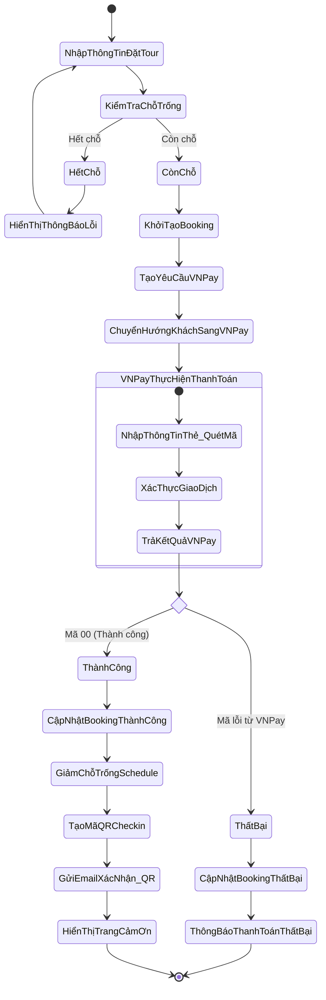
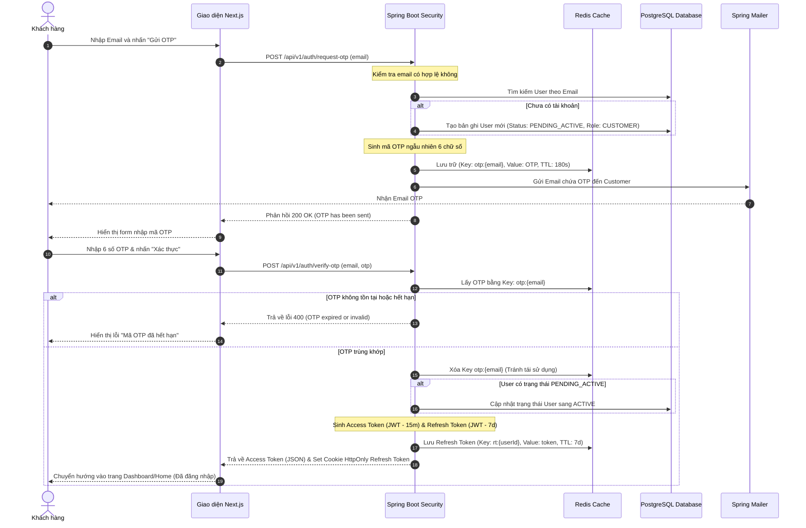
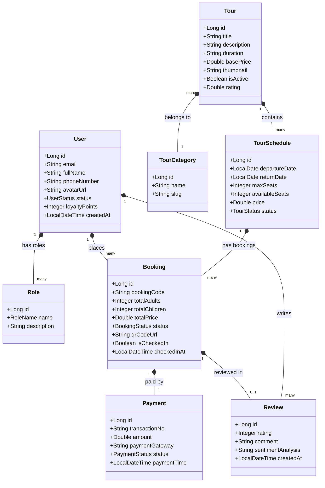
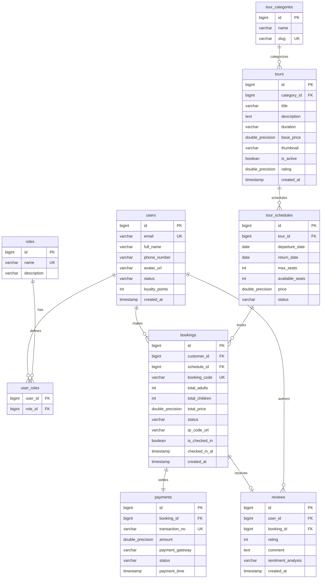
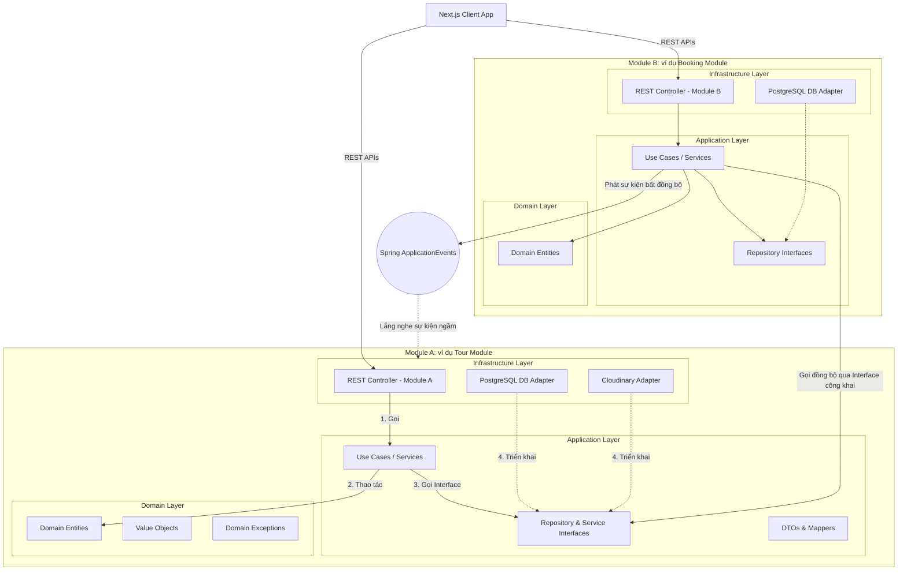
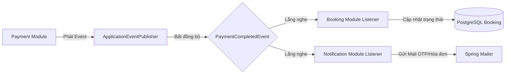
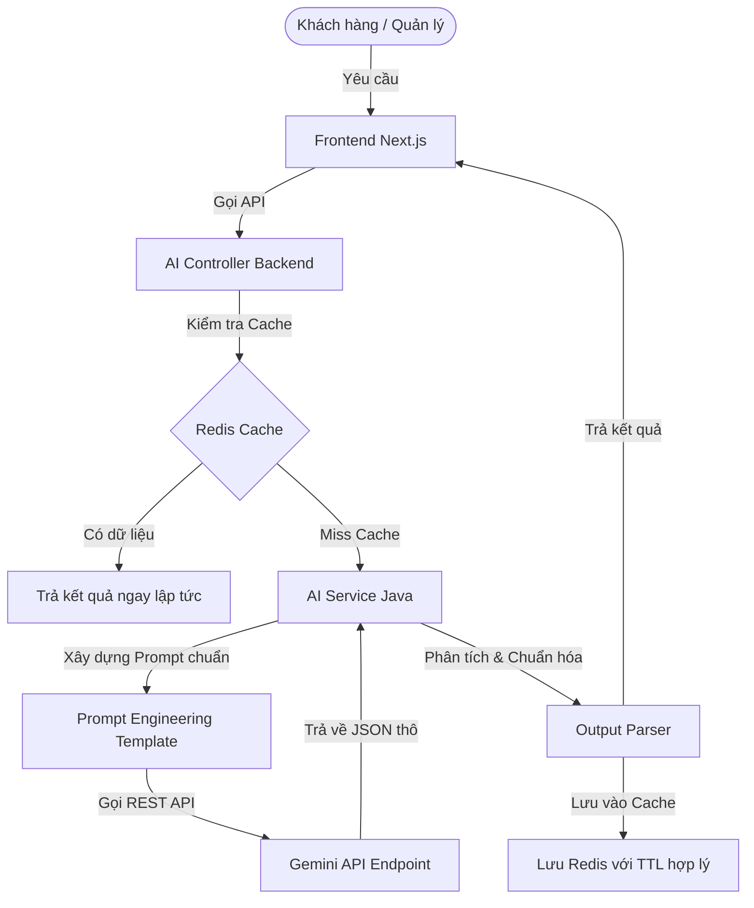

# TÀI LIỆU PHÂN TÍCH VÀ THIẾT KẾ HỆ THỐNG
## HỆ THỐNG QUẢN LÝ VÀ ĐẶT TOUR DU LỊCH QUY NHƠN TÍCH HỢP AI (AI-POWERED QUY NHON TOURISM MANAGEMENT SYSTEM)

---

### MỤC LỤC
1. [Business Requirements (Yêu cầu Nghiệp vụ)](#1-business-requirements)
2. [Functional Requirements (Yêu cầu Chức năng)](#2-functional-requirements)
3. [Non-Functional Requirements (Yêu cầu Phi chức năng)](#3-non-functional-requirements)
4. [User Stories (Kịch bản Người dùng)](#4-user-stories)
5. [Use Case Diagram (Biểu đồ Ca sử dụng)](#5-use-case-diagram)
6. [Use Case Description (Mô tả Ca sử dụng)](#6-use-case-description)
7. [Activity Diagram (Biểu đồ Hoạt động)](#7-activity-diagram)
8. [Sequence Diagram (Biểu đồ Tuần tự)](#8-sequence-diagram)
9. [Class Diagram (Biểu đồ Lớp)](#9-class-diagram)
10. [ERD (Biểu đồ Quan hệ Thực thể)](#10-erd)
11. [Database Design (Thiết kế Cơ sở Dữ liệu)](#11-database-design)
12. [Backend Architecture - Spring Boot (Kiến trúc Backend)](#12-backend-architecture)
13. [Frontend Architecture - Next.js (Kiến trúc Frontend)](#13-frontend-architecture)
14. [JWT + Email OTP Authentication Flow (Luồng Xác thực)](#14-jwt--email-otp-authentication-flow)
15. [AI Module Architecture (Kiến trúc Module AI)](#15-ai-module-architecture)
16. [REST API Design (Thiết kế API)](#16-rest-api-design)
17. [Folder Structure (Cấu trúc Thư mục Dự án)](#17-folder-structure)
18. [Redis Caching Strategy (Chiến lược Cache với Redis)](#18-redis-caching-strategy)
19. [Security Design (Thiết kế Bảo mật)](#19-security-design)
20. [Docker Deployment (Cấu hình Docker)](#20-docker-deployment)
21. [CI/CD Design (Thiết kế Tích hợp & Triển khai liên tục)](#21-cicd-design)
22. [Sprint Planning (Kế hoạch Phát triển Sprint)](#22-sprint-planning)
23. [Test Cases (Kịch bản Kiểm thử)](#23-test-cases)
24. [CV Description (Mô tả Dự án cho Hồ sơ xin việc)](#24-cv-description)
25. [Interview Questions and Answers (Câu hỏi Phỏng vấn & Trả lời)](#25-interview-questions-and-answers)

---

## 1. Business Requirements

### 1.1. Bối cảnh và Mục tiêu dự án
Quy Nhơn là một trong những điểm du lịch phát triển nhanh nhất tại Việt Nam với các địa danh nổi tiếng như Kỳ Co, Eo Gió, Cù Lao Xanh. Tuy nhiên, các công ty du lịch địa phương hiện nay chủ yếu vận hành thủ công hoặc sử dụng các hệ thống quản lý rời rạc. Dự án **AI-Powered Quy Nhon Tourism Management System** hướng tới việc xây dựng một nền tảng du lịch thông minh, tối ưu hóa quy trình vận hành và ứng dụng Generative AI để cá nhân hóa hành trình của du khách.

### 1.2. Khách hàng mục tiêu (Target Audience)
*   **Khách du lịch tự túc:** Muốn tự lên lịch trình dựa trên sở thích cá nhân và ngân sách mà không cần qua đại lý.
*   **Khách du lịch theo nhóm/gia đình:** Tìm kiếm các tour trọn gói tối ưu chi phí và thời gian.
*   **Doanh nghiệp lữ hành (Công ty vận hành):** Đội ngũ Admin, Manager, Staff quản lý tour và dữ liệu khách hàng.
*   **Hướng dẫn viên du lịch (Tour Guides):** Sử dụng thiết bị di động để nhận tour và kiểm soát khách hàng tại hiện trường.

### 1.3. Mô hình doanh thu (Revenue Streams)
*   Doanh thu trực tiếp từ việc bán tour trọn gói và dịch vụ đi kèm (đưa đón sân bay, khách sạn, vé tham quan).
*   Phí dịch vụ lập lịch trình cá nhân hóa nâng cao bằng AI (Premium AI Travel Planner).
*   Quảng cáo và liên kết dịch vụ bên thứ ba (nhà hàng, khách sạn đối tác).

### 1.4. Đề xuất Giá trị Cốt lõi (Value Propositions)
*   **AI-Driven Personalization:** Lên kế hoạch tự động trong 30 giây bằng Gemini API thay vì mất hàng giờ tự tìm kiếm thông tin.
*   **Real-time Operations:** Tích hợp Check-in QR Code cho Hướng dẫn viên du lịch và thông báo Email OTP tự động.
*   **Tối ưu hóa doanh thu:** Thuật toán định giá động (Dynamic Pricing) đề xuất mức giá tối ưu dựa trên nhu cầu thị trường.

---

## 2. Functional Requirements

Hệ thống phân quyền chi tiết với 5 vai trò (Roles) chính:

| Vai trò | Phân quyền & Chức năng cốt lõi |
| :--- | :--- |
| **Customer** | - Đăng ký, đăng nhập bằng Email OTP.<br>- Tìm kiếm, lọc tour (địa điểm, giá cả, thời gian, loại tour).<br>- Đặt tour và thanh toán trực tuyến qua cổng VNPay.<br>- Xem lịch sử đặt tour, đánh giá chất lượng tour (Reviews).<br>- Sử dụng AI Planner lên lịch trình tự động.<br>- Trò chuyện với AI Chatbot để nhận tư vấn du lịch Quy Nhơn. |
| **Tour Guide** | - Đăng nhập tài khoản nội bộ.<br>- Xem danh sách tour được phân công điều hành.<br>- Quản lý danh sách hành khách chi tiết.<br>- Thực hiện quét QR Code để Check-in khách tại điểm tập kết.<br>- Cập nhật trạng thái tour (Đang diễn ra, Hoàn thành, Hoãn). |
| **Staff** | - Kiểm tra, phê duyệt hoặc cập nhật trạng thái Booking (Đã đặt, Đã thanh toán, Đã hủy).<br>- Đổi lịch trình hoặc hủy tour cho khách khi có yêu cầu.<br>- Quản lý hồ sơ thông tin khách hàng.<br>- Phản hồi các yêu cầu trợ giúp từ khách hàng. |
| **Manager** | - CRUD Quản lý thông tin Tour, Danh mục tour, Lịch trình tour.<br>- Quản lý nhân sự Staff và phân công Tour Guide.<br>- Xem dashboard thống kê doanh thu theo tuần/tháng/năm.<br>- Xem báo cáo phản hồi khách hàng thông qua phân tích cảm xúc đánh giá bằng AI (AI Review Analyzer).<br>- Quản lý giá động đề xuất bởi hệ thống AI. |
| **Admin** | - Quản lý toàn bộ danh mục tài khoản người dùng và phân quyền (Role-based Access Control).<br>- Cấu hình tham số hệ thống: tham số kết nối VNPay, hạn mức API Gemini, thiết lập Redis TTL.<br>- Quản lý và xử lý tranh chấp giao dịch thanh toán.<br>- Kiểm tra Audit Log của hệ thống. |

---

## 3. Non-Functional Requirements

### 3.1. Hiệu năng (Performance)
*   **Thời gian phản hồi (Response Time):** Các API thông thường phải phản hồi dưới 300ms. Đối với các API xử lý AI (Gemini), thời gian trả kết quả dưới 2.5s (áp dụng cơ chế streaming hoặc tối ưu prompts).
*   **Khả năng chịu tải (Throughput):** Hệ thống đáp ứng tối thiểu 1,000 requests/second (RPS) đồng thời.
*   **Caching:** 90% các truy vấn lấy danh sách Tour tĩnh hoặc thông tin chi tiết Tour phải được phục vụ trực tiếp từ Redis Cache để giảm tải cho PostgreSQL.

### 3.2. Tính sẵn sàng & Khả năng mở rộng (Availability & Scalability)
*   Hệ thống duy trì độ sẵn sàng **SLA 99.9%**.
*   **Scalability:** Thiết kế stateless cho cả Backend và Frontend, cho phép scale-out dễ dàng bằng cách tăng số lượng Docker Container phía sau Nginx Load Balancer.

### 3.3. Bảo mật (Security)
*   Mã hóa toàn bộ mật khẩu người dùng bằng thuật toán **BCrypt** (strength = 12).
*   Truy cập API được bảo vệ bằng cơ chế **JWT (JSON Web Token)** với thời gian sống ngắn (Access Token: 15 phút, Refresh Token: 7 ngày lưu trong HttpOnly Cookie).
*   Chống các lỗ hổng OWASP Top 10: SQL Injection (sử dụng Hibernate Parameterized Queries), XSS (sử dụng Next.js auto-escaping), CSRF (sử dụng Cookie SameSite).

### 3.4. Trải nghiệm người dùng (Usability)
*   Giao diện responsive tương thích hoàn hảo trên các thiết bị Mobile, Tablet và Desktop.
*   Chế độ sáng/tối (Dark/Light Mode) mượt mà dựa trên TailwindCSS CSS Variables.

---

## 4. User Stories

### US-01: Lên lịch trình du lịch thông minh bằng AI
*   **As a** Khách du lịch tự túc
*   **I want to** nhập ngân sách dự kiến, số ngày đi, số lượng người và sở thích cá nhân để AI tạo cho tôi một lịch trình tour Quy Nhơn hoàn chỉnh.
*   **Acceptance Criteria:**
    1. Hệ thống hiển thị form nhập thông tin trực quan.
    2. Khi nhấn nút "Tạo lịch trình", hệ thống gửi yêu cầu đến Gemini API kèm prompt được thiết lập sẵn.
    3. Kết quả trả về gồm danh sách các ngày với chi tiết địa điểm tham quan sáng/chiều/tối, ước tính chi phí, và các tour hiện có trên hệ thống phù hợp với lịch trình này.
    4. Người dùng có thể lưu lịch trình này vào hồ sơ cá nhân hoặc tải xuống dưới dạng PDF.

### US-02: Đăng nhập bảo mật không mật khẩu bằng Email OTP
*   **As a** Khách hàng
*   **I want to** đăng nhập bằng cách nhận mã OTP qua email thay vì nhớ mật khẩu phức tạp.
*   **Acceptance Criteria:**
    1. Khách hàng nhập email vào màn hình đăng nhập.
    2. Hệ thống gửi mã OTP gồm 6 chữ số vào email của khách hàng thông qua Spring Mail Server, đồng thời mã OTP này được lưu vào Redis với TTL là 3 phút.
    3. Khách hàng nhập OTP và gửi xác nhận. Hệ thống kiểm tra trùng khớp và cấp phát JWT token (Access Token & Refresh Token) để đăng nhập thành công.

### US-03: Kiểm tra thông tin hành khách bằng QR Code
*   **As a** Hướng dẫn viên du lịch
*   **I want to** quét mã QR Code trên vé của khách hàng bằng camera điện thoại của tôi để check-in họ vào đoàn.
*   **Acceptance Criteria:**
    1. Khi khách đặt tour thành công, hệ thống gửi email kèm QR Code chứa thông tin mã đặt chỗ mã hóa.
    2. Hướng dẫn viên truy cập ứng dụng Next.js, mở camera quét mã QR.
    3. Ứng dụng gọi đến API `/api/v1/tour-guide/checkin` gửi kèm chuỗi mã QR.
    4. Hệ thống kiểm tra trạng thái booking trong PostgreSQL. Nếu hợp lệ, chuyển trạng thái khách thành "Đã Check-in" và phản hồi thông tin khách hàng (Tên, SĐT, Số lượng vé) lên màn hình của Hướng dẫn viên kèm thông báo thành công.

---

## 5. Use Case Diagram

Dưới đây là sơ đồ Use Case tổng quan thể hiện sự tương tác của các tác nhân (Actors) với các chức năng chính trong hệ thống:

```mermaid
rect User Interface
  classDef actor fill:#f9f,stroke:#333,stroke-width:2px;
  classDef usecase fill:#bbf,stroke:#333,stroke-width:1px;
end

graph TD
  Customer((Customer)):::actor
  TourGuide((Tour Guide)):::actor
  Staff((Staff)):::actor
  Manager((Manager)):::actor
  Admin((Admin)):::actor

  %% Customer Use Cases
  Customer --> UC_Auth[Đăng ký/Đăng nhập OTP]:::usecase
  Customer --> UC_SearchTour[Tìm kiếm & Lọc Tour]:::usecase
  Customer --> UC_BookTour[Đặt Tour & Thanh toán VNPay]:::usecase
  Customer --> UC_AIPlanner[Sử dụng AI Travel Planner]:::usecase
  Customer --> UC_AIChatbot[Trò chuyện AI Chatbot]:::usecase
  Customer --> UC_Review[Đánh giá & Bình luận Tour]:::usecase

  %% Tour Guide Use Cases
  TourGuide --> UC_ViewAssigned[Xem lịch Tour phân công]:::usecase
  TourGuide --> UC_QRCodeCheckin[Check-in khách bằng QR Code]:::usecase
  TourGuide --> UC_UpdateTourStatus[Cập nhật trạng thái Tour]:::usecase

  %% Staff Use Cases
  Staff --> UC_ManageBooking[Quản lý Booking & Trạng thái]:::usecase
  Staff --> UC_CustomerSupport[Hỗ trợ khách hàng]:::usecase
  Staff --> UC_UpdateSchedule[Cập nhật chi tiết Lịch trình]:::usecase

  %% Manager Use Cases
  Manager --> UC_CRUDTour[Quản lý Tour & Giá cả]:::usecase
  Manager --> UC_AssignStaff[Phân công HDV & Nhân viên]:::usecase
  Manager --> UC_Report[Xem Báo cáo Doanh thu & AI Sentiment]:::usecase

  %% Admin Use Cases
  Admin --> UC_ManageUser[Quản lý Phân quyền Người dùng]:::usecase
  Admin --> UC_ConfigSystem[Cấu hình Tham số AI & VNPay]:::usecase

  %% Inheritances / Associations
  Manager -.-> |includes| Staff
  Admin -.-> |includes| Manager
```

---

## 6. Use Case Description

### Chi tiết Ca sử dụng: Đặt Tour và Thanh toán Trực tuyến (UC_BookTour)

*   **Tên ca sử dụng:** Đặt Tour và Thanh toán Trực tuyến
*   **Tác nhân chính:** Customer
*   **Tác nhân hỗ trợ:** VNPay Gateway, Email Service
*   **Mô tả:** Khách hàng tiến hành chọn số lượng chỗ, nhập thông tin hành khách đi cùng, thực hiện thanh toán trực tuyến qua cổng VNPay để xác nhận đặt tour du lịch.
*   **Tiền điều kiện:** Khách hàng đã đăng nhập vào hệ thống và đang xem chi tiết một tour cụ thể còn chỗ trống.
*   **Luồng sự kiện chính (Basic Flow):**
    1. Khách hàng nhấn chọn "Đặt Tour".
    2. Hệ thống hiển thị form nhập thông tin bao gồm: Ngày khởi hành mong muốn (trong danh sách lịch trình hoạt động), Số lượng người lớn, Số lượng trẻ em, Thông tin liên hệ và các yêu cầu đặc biệt.
    3. Hệ thống kiểm tra số lượng chỗ trống trong cơ sở dữ liệu. Nếu còn đủ chỗ, hệ thống tính toán tổng tiền tạm tính (đã áp dụng Dynamic Pricing/Giảm giá nếu có).
    4. Khách hàng chọn phương thức thanh toán "VNPay" và nhấn "Xác nhận & Thanh toán".
    5. Hệ thống khởi tạo một giao dịch đặt tour ở trạng thái `PENDING_PAYMENT` và tạo URL thanh toán VNPay bằng cách gọi thư viện mã hóa của VNPay.
    6. Hệ thống chuyển hướng khách hàng sang cổng thanh toán của VNPay.
    7. Khách hàng thực hiện thao tác quét mã QR hoặc nhập tài khoản ngân hàng để hoàn thành giao dịch trên VNPay.
    8. VNPay xử lý giao dịch và gọi webhook IPN (Instant Payment Notification) về server Backend Spring Boot của hệ thống.
    9. Hệ thống xác nhận giao dịch thành công từ IPN, cập nhật trạng thái Booking thành `PAID`, trừ số lượng chỗ trống tương ứng của Tour Schedule.
    10. Hệ thống tạo mã QR Check-in duy nhất và gửi Email xác nhận đặt tour kèm hóa đơn và mã QR cho khách hàng.
    11. Khách hàng được chuyển hướng về trang kết quả thành công trên giao diện Next.js.
*   **Luồng rẽ nhánh (Alternative Flows):**
    *   *Trường hợp hết chỗ (Bước 3):* Hệ thống thông báo tour đã đủ số lượng người đăng ký trong ngày đó, đề xuất khách hàng chọn ngày khác hoặc tham gia danh sách chờ.
    *   *Trường hợp giao dịch thanh toán thất bại (Bước 8):* Khách hàng hủy giao dịch hoặc thẻ không đủ số dư. VNPay trả mã lỗi về IPN/Redirect URL. Hệ thống cập nhật trạng thái Booking thành `FAILED_PAYMENT` và gửi thông báo đề xuất khách hàng thanh toán lại trong vòng 30 phút trước khi tự động hủy.

---

## 7. Activity Diagram

Quy trình đặt tour và xử lý thanh toán từ phía Khách hàng đến hệ thống và VNPay:



---

## 8. Sequence Diagram

Luồng xác thực không mật khẩu (Passwordless Authentication) sử dụng Email OTP và sinh mã định danh JWT:



---

## 9. Class Diagram

Biểu đồ lớp biểu diễn cấu trúc miền dữ liệu (Domain Model) cốt lõi của hệ thống du lịch:



---

## 10. ERD (Entity-Relationship Diagram)

Mô hình thực thể quan hệ cơ sở dữ liệu chi tiết cho PostgreSQL:



---

## 11. Database Design

Hệ thống sử dụng cơ sở dữ liệu quan hệ **PostgreSQL**. Dưới đây là đặc tả chi tiết của các bảng chính:

### 11.1. Bảng `users` (Thông tin người dùng)
*   `id` (BIGSERIAL, Primary Key)
*   `email` (VARCHAR(150), Unique, Not Null)
*   `full_name` (VARCHAR(100))
*   `phone_number` (VARCHAR(20))
*   `avatar_url` (VARCHAR(255))
*   `status` (VARCHAR(30)) - Gồm: `PENDING_ACTIVE`, `ACTIVE`, `BLOCKED`.
*   `loyalty_points` (INT, Default 0)
*   `created_at` (TIMESTAMP, Default CURRENT_TIMESTAMP)

### 11.2. Bảng `tours` (Thông tin các Tour du lịch)
*   `id` (BIGSERIAL, Primary Key)
*   `category_id` (BIGINT, Foreign Key references `tour_categories(id)`)
*   `title` (VARCHAR(255), Not Null)
*   `description` (TEXT)
*   `duration` (VARCHAR(50)) - Ví dụ: "3 ngày 2 đêm", "Trong ngày".
*   `base_price` (NUMERIC(12,2), Not Null)
*   `thumbnail` (VARCHAR(255)) - Link ảnh lưu tại Cloudinary.
*   `is_active` (BOOLEAN, Default True)
*   `rating` (NUMERIC(3,2), Default 0.0)

### 11.3. Bảng `tour_schedules` (Chi tiết lịch khởi hành của từng Tour)
*   `id` (BIGSERIAL, Primary Key)
*   `tour_id` (BIGINT, Foreign Key references `tours(id)`)
*   `departure_date` (DATE, Not Null)
*   `return_date` (DATE, Not Null)
*   `max_seats` (INT, Not Null)
*   `available_seats` (INT, Not Null)
*   `price` (NUMERIC(12,2), Not Null) - Giá áp dụng riêng cho lịch trình này (đã qua thuật toán Dynamic Pricing).
*   `status` (VARCHAR(30)) - Gồm: `UPCOMING`, `DEPARTED`, `COMPLETED`, `CANCELLED`.

### 11.4. Bảng `bookings` (Thông tin giao dịch đặt tour)
*   `id` (BIGSERIAL, Primary Key)
*   `customer_id` (BIGINT, Foreign Key references `users(id)`)
*   `schedule_id` (BIGINT, Foreign Key references `tour_schedules(id)`)
*   `booking_code` (VARCHAR(50), Unique, Not Null) - Mã đặt chỗ để tra cứu.
*   `total_adults` (INT, Not Null)
*   `total_children` (INT, Default 0)
*   `total_price` (NUMERIC(12,2), Not Null)
*   `status` (VARCHAR(30)) - Gồm: `PENDING_PAYMENT`, `PAID`, `CANCELLED`, `FAILED_PAYMENT`.
*   `qr_code_url` (VARCHAR(255))
*   `is_checked_in` (BOOLEAN, Default False)
*   `checked_in_at` (TIMESTAMP)
*   `created_at` (TIMESTAMP, Default CURRENT_TIMESTAMP)

### 11.5. Indexing & Optimization Strategy
*   **Index trên Unique Keys:** Mặc định PostgreSQL tạo index B-Tree trên các trường Primary Key và Unique Key (`email`, `booking_code`).
*   **Index bổ sung (Composite & Single Indexes):**
    *   `idx_tours_category`: Index trên cột `category_id` của bảng `tours` để tối ưu hóa việc truy vấn danh sách tour theo danh mục.
    *   `idx_schedules_date`: Index trên cột `departure_date` của bảng `tour_schedules` để phục vụ chức năng tìm kiếm tour theo ngày khởi hành.
    *   `idx_bookings_customer`: Index trên `customer_id` để tối ưu hóa truy vấn lịch sử giao dịch của khách hàng.
*   **Full-Text Search:** Thiết lập cấu hình sử dụng `tsvector` trên trường `title` và `description` của bảng `tours` để tìm kiếm thông minh từ khóa không dấu/có dấu tiếng Việt.

---

## 12. Backend Architecture - Spring Boot

Hệ thống được thiết kế theo sự kết hợp giữa hai mẫu kiến trúc hiện đại: **Modular Monolith (Monolith mô-đun hóa)** và **Clean Architecture (Kiến trúc sạch)** tại mỗi mô-đun. Cấu trúc này vừa đảm bảo tính dễ phát triển và triển khai của Monolith, vừa giúp hệ thống có khả năng chuyển đổi sang Microservices cực kỳ dễ dàng khi cần thiết nhờ vào ranh giới mô-đun độc lập và sự tách biệt rõ ràng của các tầng logic.

### 12.1. Sơ đồ Kiến trúc Tổng quan (Modular Monolith + Clean Architecture)

Dưới đây là sơ đồ thể hiện cách chia các mô-đun nghiệp vụ độc lập và cấu trúc 3 lớp (Domain, Application, Infrastructure) của Clean Architecture bên trong mỗi mô-đun:



---

### 12.2. Các Nguyên tắc Thiết kế Cốt lõi

#### 1. Ranh giới Mô-đun Nghiệp vụ (Module Boundaries)
*   **Độc lập logic:** Mỗi mô-đun đại diện cho một domain nghiệp vụ khép kín (ví dụ: `tour`, `booking`, `payment`, `ai`, `user`, `notification`).
*   **Hạn chế phụ thuộc chéo (Coupling):** Một mô-đun không được phép tham chiếu trực tiếp đến các lớp nội bộ (`domain` hoặc `infrastructure`) của mô-đun khác.
*   **Điểm truy cập công khai (Public API):** Nếu Module B cần lấy dữ liệu từ Module A, nó chỉ được phép gọi thông qua một lớp Application Service được đóng gói sẵn và expose công khai của Module A, không được phép truy cập trực tiếp vào DB của Module A.

#### 2. Kiến trúc Sạch (Clean Architecture) trong từng Mô-đun
Kiến trúc bên trong mỗi mô-đun được phân tách thành 3 tầng chính với nguyên tắc chiều phụ thuộc (Dependency Rule): **Lớp ngoài phụ thuộc vào lớp trong, lớp trong tuyệt đối không biết gì về lớp ngoài.**

*   **A. Tầng Domain (Domain Layer) - Lõi Nghiệp Vụ:**
    *   **Tính chất:** Hoàn toàn thuần Java (POJO). Không sử dụng bất kỳ thư viện hay framework nào liên quan đến Spring Boot, Hibernate/JPA hay database.
    *   **Thành phần:**
        *   *Domain Entities:* Lớp chứa thuộc tính và quy tắc nghiệp vụ cốt lõi (ví dụ: thực thể `Tour` kiểm tra quy tắc giá cơ bản không được âm).
        *   *Value Objects:* Các đối tượng mô tả đặc tính không có định danh độc lập (ví dụ: `Price`, `Duration`).
        *   *Domain Exceptions:* Các lỗi nghiệp vụ đặc thù (ví dụ: `SeatsNotAvailableException`).
*   **B. Tầng Application (Application Layer) - Logic Ứng Dụng:**
    *   **Tính chất:** Chứa logic luồng đi của ứng dụng. Định nghĩa cách thức hệ thống phản hồi các yêu cầu từ thế giới bên ngoài. Tầng này cũng độc lập với các thư viện bên ngoài (external libraries) nhưng có thể sử dụng các annotation cơ bản nếu cần.
    *   **Thành phần:**
        *   *Use Cases (Services):* Lớp thực thi các ca sử dụng (ví dụ: `CreateBookingUseCase` nhận request, gọi domain kiểm tra số ghế, thực hiện trừ ghế và lưu kết quả).
        *   *Ports:* Cổng kết nối mà Application định nghĩa để giao tiếp với bên ngoài. Gồm hai loại:
            1.  *Input Ports (Inbound):* Thường là các Use Case Interfaces để tầng Controller gọi vào.
            2.  *Output Ports (Outbound):* Các Interfaces định nghĩa việc lưu trữ dữ liệu (ví dụ: `TourRepository` interface) hoặc gọi dịch vụ bên ngoài (ví dụ: `GeminiClient` interface).
        *   *DTOs & Mappers:* Lớp cấu trúc dữ liệu gửi/nhận và bộ chuyển đổi dữ liệu giữa Entity và DTO.
*   **C. Tầng Infrastructure (Infrastructure Layer) - Chi Tiết Kỹ Thuật:**
    *   **Tính chất:** Nơi chứa các công nghệ cụ thể như Spring Boot Framework, PostgreSQL Database, Redis Cache, Gemini API, Cloudinary.
    *   **Thành phần:**
        *   *REST Controllers:* Điểm tiếp nhận request từ Client (Next.js), chuyển đổi JSON thành DTO và gọi Use Case tương ứng.
        *   *JPA Entities & Spring Data Repositories:* Các thực thể ánh xạ xuống bảng PostgreSQL vật lý (`TourJpaEntity`) và interface JPA kế thừa từ Spring Data.
        *   *Adapters:* Lớp thực thi (implement) các Output Ports của tầng Application (ví dụ: `PostgreSQLTourRepositoryAdapter` implement `TourRepository` interface để thực tế gọi Spring Data và lưu xuống PostgreSQL).

---

### 12.3. Cơ chế Giao tiếp Liên Mô-đun (Inter-module Communication)

Để giữ các mô-đun lỏng lẻo (loose coupling) và dễ phân rã thành microservices, chúng ta sử dụng hai cơ chế giao tiếp:

#### 1. Giao tiếp Đồng bộ (Synchronous Communication)
*   **Cách thức:** Module B gọi trực tiếp một Spring Bean Service (Interface) được công khai của Module A.
*   **Ví dụ:** Khi khách hàng đặt tour ở `BookingModule`, Use Case đặt tour cần lấy thông tin giá hiện tại từ `TourModule`. Lúc này, `CreateBookingUseCase` sẽ gọi qua `TourService` (Interface nằm trong Application của `TourModule`) để lấy thông tin.

#### 2. Giao tiếp Bất đồng bộ qua Sự kiện (Asynchronous Event-Driven)
*   **Cách thức:** Sử dụng `ApplicationEventPublisher` của Spring để phát sự kiện và `@EventListener` hoặc `@TransactionalEventListener` để nhận sự kiện ngầm.
*   **Ví dụ:** Khi thanh toán thành công tại `PaymentModule`, hệ thống phát đi sự kiện `PaymentCompletedEvent`. 
    *   `BookingModule` lắng nghe sự kiện này để cập nhật trạng thái Booking sang `PAID` và tạo mã QR.
    *   `NotificationModule` lắng nghe để soạn email gửi hóa đơn và mã QR cho khách hàng.
    *   `PaymentModule` hoàn toàn không cần biết `BookingModule` hay `NotificationModule` sẽ làm gì tiếp theo, giảm thiểu tối đa coupling.



#### 3. Ranh giới Cơ sở Dữ liệu Logical (Logical Database Boundary)
*   **Nguyên tắc:** Mỗi mô-đun chỉ được phép đọc/ghi vào các bảng do chính mô-đun đó quản lý.
*   **Cấm Join chéo:** Tuyệt đối không viết câu lệnh `@Query` JPA thực hiện phép JOIN giữa bảng thuộc Module A với bảng thuộc Module B (ví dụ: không join bảng `bookings` với bảng `users` ở mức JPA `@ManyToOne` trực tiếp thực thể). 
*   **Giải pháp:** Chỉ lưu trữ khóa ngoại ở dạng thô (`Long customerId` thay vị trí thực thể `@ManyToOne User user`). Khi cần hiển thị thông tin chi tiết, tầng Application sẽ gọi chéo mô-đun ở mức Java để lấy dữ liệu User và ghép vào DTO phản hồi. Điều này đảm bảo khi tách thành Microservices, cơ sở dữ liệu có thể dễ dàng chia tách thành các database vật lý riêng biệt mà không làm lỗi phần code JPA.

### 12.4. Các Thành phần Kiến trúc Bổ trợ
1.  **Global Exception Handling:** Sử dụng `@RestControllerAdvice` và `@ExceptionHandler` để bắt toàn bộ biệt lệ (Exceptions) trong hệ thống và trả về format JSON chuẩn xác định lỗi cho Frontend thay vì lỗi Stacktrace thô.
2.  **Spring Security & JWT Filter:** Cấu hình Security Filter Chain thực hiện trích xuất Bearer Token từ request header, giải mã chữ ký HS256, kiểm tra tính hợp lệ và cấu hình SecurityContext cho người dùng.
3.  **Auditing:** Sử dụng `@EnableJpaAuditing` để tự động điền các trường thời gian tạo, thời gian sửa (`createdAt`, `updatedAt`) của các thực thể.

---

## 13. Frontend Architecture - Next.js

Ứng dụng Frontend xây dựng dựa trên phiên bản **Next.js 15 (App Router)** với ngôn ngữ **TypeScript**:

```
+-------------------------------------------------------------+
|                         App Router                          |
|         (app/layout.tsx, app/page.tsx, app/tours)           |
+-------------------------------------------------------------+
            |                                      |
            v (Server components)                  v (Client components)
+------------------------+             +------------------------+
| Server-Side Rendering  |             | State Management       |
| (SSR) / Static Site    |             | (Redux Toolkit)        |
| Generation (SSG)       |             | - Giỏ hàng, User Auth  |
| - Chi tiết Tour        |             +------------------------+
| - Trang chủ            |                         |
+------------------------+                         v
                                       +------------------------+
                                       | API Fetching (Axios)   |
                                       | - Interceptors         |
                                       | - Refresh Token flow   |
                                       +------------------------+
```

### Đặc trưng chính:
1.  **Server Components (RSC) vs Client Components:** Các trang hiển thị thông tin như Danh sách Tour, Chi tiết Tour được thiết kế là Server Components để tăng tốc độ tải trang ban đầu (FCP) và tối ưu SEO tối đa. Màn hình Đặt tour, Thanh toán, Lịch trình AI được định nghĩa `'use client'` để tương tác động mạnh mẽ với client-side state.
2.  **Axios Client Instance & Interceptors:**
    *   Tự động đính kèm `Authorization: Bearer <Access_Token>` vào header trước mỗi request gửi lên Backend.
    *   **Response Interceptor:** Bắt lỗi `401 Unauthorized` từ Backend. Khi xảy ra lỗi này, client tự động gọi API `/api/v1/auth/refresh-token` để lấy Access Token mới và thực hiện lại API call bị lỗi mà người dùng không bị thoát khỏi phiên đăng nhập.

---

## 14. JWT + Email OTP Authentication Flow

Quy trình xác thực được thiết kế chặt chẽ nhằm kết hợp tính bảo mật cao và sự tiện lợi:

### 14.1. Quy trình Đăng ký & Kích hoạt tài khoản
1.  Người dùng gửi Email để đăng ký.
2.  Hệ thống tạo User với trạng thái `PENDING_ACTIVE`.
3.  Gửi mã OTP (6 số ngẫu nhiên) qua Email của khách hàng, lưu vào Redis với thời gian sống 3 phút.
4.  Người dùng nhập OTP gửi lên hệ thống. Nếu đúng, cập nhật trạng thái User thành `ACTIVE`.

### 14.2. Quy trình Đăng nhập
1.  Khách hàng nhập Email.
2.  Hệ thống gửi OTP về Email, lưu Redis.
3.  Người dùng nhập OTP chính xác.
4.  Hệ thống sinh JWT bao gồm:
    *   **Access Token:** Lưu trong bộ nhớ ngắn hạn của App (Redux state), thời hạn 15 phút.
    *   **Refresh Token:** Lưu trong **HttpOnly Cookie** với thuộc tính `Secure`, `SameSite=Strict`, thời hạn 7 ngày.
5.  Mỗi lần gửi request cần xác thực, Client Next.js gửi kèm Access Token trong Header `Authorization: Bearer <token>`.

---

## 15. AI Module Architecture

Tích hợp **Gemini API** (Google) để xây dựng hệ thống thông minh, sơ đồ luồng dữ liệu của Module AI:



### Các chức năng AI chi tiết:
1.  **AI Travel Planner Prompt:**
    ```text
    "Hãy đóng vai một chuyên gia du lịch địa phương tại Quy Nhơn. Hãy lập lịch trình du lịch Quy Nhơn cho [Số người] người trong vòng [Số ngày] ngày với tổng ngân sách [Ngân sách] VNĐ. Sở thích của nhóm là [Sở thích]. Hãy trả kết quả theo cấu trúc JSON định dạng: { 'days': [ { 'day': 1, 'activities': [ { 'time': 'Sáng', 'location': 'Tên điểm', 'cost': 100000, 'description': 'Mô tả ngắn' } ] } ], 'totalEstimatedCost': 1500000 }"
    ```
2.  **AI Review Analyzer (Phân tích cảm xúc):**
    *   Được kích hoạt tự động qua Spring Events/Kafka khi khách hàng gửi review.
    *   Hệ thống gửi nội dung comment của khách hàng đến Gemini API để phân loại thuộc tính: `POSITIVE`, `NEUTRAL`, `NEGATIVE`.
    *   Kết quả phân tích giúp Manager nắm bắt chất lượng phục vụ của từng tour qua biểu đồ trực quan.

---

## 16. REST API Design

Thiết kế API theo chuẩn RESTful đầy đủ, phiên bản `/api/v1`:

### 16.1. Nhóm API Quản lý Tour (Tours API)
*   `GET /api/v1/tours` - Lấy danh sách Tour (Hỗ trợ phân trang, lọc theo danh mục, ngày, khoảng giá).
*   `GET /api/v1/tours/{id}` - Lấy thông tin chi tiết Tour (Dữ liệu cache).
*   `POST /api/v1/tours` - Tạo mới Tour (Role: `MANAGER`, `ADMIN`).
*   `PUT /api/v1/tours/{id}` - Cập nhật thông tin Tour.
*   `DELETE /api/v1/tours/{id}` - Xóa logic/Mở khóa Tour.

### 16.2. Nhóm API Đặt Tour (Booking API)
*   `POST /api/v1/bookings` - Tạo giao dịch đặt chỗ mới (Trạng thái: `PENDING_PAYMENT`).
    *   *Request Body:*
        ```json
        {
          "scheduleId": 12,
          "totalAdults": 2,
          "totalChildren": 1,
          "contactName": "Nguyen Van A",
          "contactPhone": "0912345678"
        }
        ```
*   `GET /api/v1/bookings/my-history` - Xem lịch sử đặt tour của người dùng hiện tại (Role: `CUSTOMER`).
*   `POST /api/v1/bookings/payment/vnpay-url` - Sinh link thanh toán VNPay cho Booking.

### 16.3. Nhóm API Hỗ trợ AI (AI API)
*   `POST /api/v1/ai/planner` - Nhận các tham số đầu vào và trả về lịch trình tour tạo bởi AI.
    *   *Request Body:*
        ```json
        {
          "budget": 5000000,
          "days": 3,
          "peopleCount": 2,
          "preferences": "Thích tắm biển, ăn hải sản, thích đi đảo"
        }
        ```

---

## 17. Folder Structure

### 17.1. Cấu trúc thư mục Backend (Spring Boot - Modular Monolith + Clean Architecture)
```text
l:\tourism
├── .gitignore
├── build.gradle
├── settings.gradle
├── gradlew
└── src
    ├── main
    │   ├── java
    │   │   └── ai_quynhon_tourism_management
    │   │       └── tourism
    │   │           ├── TourismApplication.java
    │   │           ├── common
    │   │           │   ├── exception           # Global Exception Handler chung
    │   │           │   ├── response            # Định dạng phản hồi API chuẩn
    │   │           │   └── security            # Cấu hình Spring Security chung
    │   │           └── modules
    │   │               ├── tour                # Module Quản lý Tour
    │   │               │   ├── domain          # TẦNG DOMAIN: Quy tắc nghiệp vụ lõi
    │   │               │   │   ├── entity      # Tour, TourCategory, TourSchedule (Java thuần)
    │   │               │   │   ├── exception   # TourNotFoundException, InvalidPriceException
    │   │               │   │   └── valueobject # Price, Duration (Value Objects)
    │   │               │   ├── application     # TẦNG APPLICATION: Logic ứng dụng & Use Cases
    │   │               │   │   ├── dto         # TourRequest, TourResponse (DTOs)
    │   │               │   │   ├── mapper      # Lớp chuyển đổi dữ liệu Entity <=> DTO
    │   │               │   │   ├── port        # Interfaces định nghĩa cổng giao tiếp
    │   │               │   │   │   ├── input   # Các Use Cases (e.g., GetTourDetailUseCase)
    │   │               │   │   │   └── output  # Các Port ra ngoài (e.g., TourRepositoryPort)
    │   │               │   │   └── usecase     # Các Service triển khai Use Case Interfaces
    │   │               │   └── infrastructure  # TẦNG INFRASTRUCTURE: Chi tiết kỹ thuật & Frameworks
    │   │               │       ├── adapter     # Các lớp triển khai Output Ports (e.g., DatabaseAdapter)
    │   │               │       ├── controller  # Các REST Controllers tiếp nhận HTTP requests
    │   │               │       ├── entity      # TourJpaEntity, ScheduleJpaEntity (Hibernate mapping)
    │   │               │       └── repository  # Spring Data JPA Interfaces truy vấn PostgreSQL
    │   │               │
    │   │               ├── booking             # Module Đặt chỗ (Cấu trúc tương tự)
    │   │               ├── payment             # Module Thanh toán VNPay
    │   │               ├── review              # Module Đánh giá và AI Sentiment Analyzer
    │   │               ├── notification        # Module Thông báo (Email, Event Listeners)
    │   │               └── ai                  # Module Gemini AI Integration
    │   └── resources
    │       ├── application.yaml             # Cấu hình môi trường dev/prod
    │       └── templates
    │           └── mail                     # File template email gửi OTP, hóa đơn
    └── test
        └── java
            └── ai_quynhon_tourism_management
                └── tourism                  # Chứa toàn bộ Integration Tests & Unit Tests
```

### 17.2. Cấu trúc thư mục Frontend (Next.js 15)
```text
frontend-nextjs
├── package.json
├── tsconfig.json
├── tailwind.config.ts
├── public
│   ├── assets
│   └── images
└── src
    └── app
        ├── layout.tsx                       # Layout chính (Navbar, Footer, Providers)
        ├── page.tsx                         # Trang chủ (Lọc Tour nhanh, Tour nổi bật)
        ├── login                            # Trang đăng nhập nhận OTP
        ├── tours
        │   ├── page.tsx                     # Trang danh sách Tour du lịch
        │   └── [id]
        │       └── page.tsx                 # Trang chi tiết Tour
        ├── booking
        │   └── [scheduleId]                 # Trang nhập thông tin hành khách & thanh toán
        ├── ai-planner
        │   └── page.tsx                     # Màn hình AI Travel Planner tương tác
        ├── components                       # UI Components dùng chung
        │   ├── ui                           # Button, Input, Modal, Dropdown (Shadcn style)
        │   ├── tour-card.tsx
        │   └── chat-bot.tsx
        ├── store                            # Cấu hình Redux Toolkit (authSlice, cartSlice)
        ├── services                         # Axios setup, API Call definitions
        └── types                            # Định nghĩa TypeScript Interfaces
```

---

## 18. Redis Caching Strategy

Sử dụng Redis làm cơ chế lưu trữ đệm phân tán để nâng cao hiệu năng hệ thống:

```
+------------------+     Không có Cache     +-----------------------+
|  Request Client  | ---------------------> | PostgreSQL (Truy vấn) |
+------------------+                        +-----------------------+
         |                                              |
         | Có Cache                                     | Lấy dữ liệu & ghi đè
         v                                              v
+------------------+                        +-----------------------+
|   Redis Cache    | <--------------------- |      Redis Save       |
+------------------+                        +-----------------------+
```

### Chiến lược cụ thể:
1.  **Cache-Aside (Lazy Loading Pattern):**
    *   Khi người dùng xem chi tiết một tour (ví dụ: ID = 5), ứng dụng tìm dữ liệu trong Redis trước (`tours::5`).
    *   Nếu có (Cache Hit), trả dữ liệu trực tiếp trong vòng 10ms.
    *   Nếu không có (Cache Miss), truy vấn PostgreSQL, lưu kết quả vào Redis với TTL là 1 giờ, sau đó trả về cho client.
2.  **Đồng bộ hóa và Xóa Cache (Eviction Policy):**
    *   Để tránh dữ liệu cũ (Stale Data), khi Manager cập nhật thông tin tour hoặc chỉnh sửa lịch trình qua API `PUT /api/v1/tours/5`, hệ thống sử dụng `@CacheEvict(value = "tours", key = "#id")` để xóa bỏ dữ liệu cũ khỏi Redis ngay lập tức.
3.  **Caching AI Responses:**
    *   Các đề xuất từ AI Planner tương ứng với các tổ hợp đầu vào cụ thể (ví dụ: budget=5tr, days=3) sẽ được hash làm key lưu trữ trong Redis với TTL là 24 giờ nhằm tiết kiệm chi phí gọi API Gemini.

---

## 19. Security Design

Bảo mật đa lớp theo tiêu chuẩn công nghiệp:

### 19.1. Phân quyền API (Role-Based Access Control - RBAC)
*   Sử dụng Annotation `@PreAuthorize("hasRole('MANAGER')")` hoặc cấu hình tập trung trong `SecurityFilterChain`:
    *   `/api/v1/admin/**` -> Chỉ có `ADMIN` được truy cập.
    *   `/api/v1/manager/**` -> `ADMIN` và `MANAGER` được truy cập.
    *   `/api/v1/tour-guide/**` -> Chỉ có `TOUR_GUIDE` được truy cập.

### 19.2. Chống Tấn công và Rò rỉ Dữ liệu
*   **SQL Injection:** Sử dụng Spring Data JPA Repository kế thừa `JpaRepository`. Toàn bộ các truy vấn SQL động phải được viết dưới dạng Parameterized Query thông qua Hibernate. Không sử dụng phép cộng chuỗi SQL thô.
*   **XSS Protection:** Dữ liệu người dùng nhập lên (đặc biệt là phần đánh giá/bình luận) được chuẩn hóa và loại bỏ các thẻ script gây hại bằng thư viện JSoup trước khi lưu vào DB.
*   **CORS Configuration:** Chỉ cho phép tên miền chính thức của Next.js client truy cập tài nguyên API thông qua cấu hình `CorsConfigurationSource`.

---

## 20. Docker Deployment

Sử dụng Docker Compose để gom nhóm và chạy tất cả các dịch vụ (PostgreSQL, Redis, Spring Boot Backend, Next.js Frontend, Nginx Load Balancer) trên cùng một máy chủ ảo VPS.

### 20.1. Dockerfile cho Backend (`l:\tourism\Dockerfile`)
```dockerfile
# Stage 1: Build JAR file
FROM gradle:8.5-jdk21 AS build
WORKDIR /app
COPY --chown=gradle:gradle . .
RUN ./gradlew build -x test --no-daemon

# Stage 2: Run Application
FROM eclipse-temurin:21-jre-jammy
WORKDIR /app
COPY --from=build /app/build/libs/*.jar app.jar
EXPOSE 8080
ENTRYPOINT ["java", "-jar", "app.jar"]
```

### 20.2. Dockerfile cho Frontend (`frontend-nextjs/Dockerfile`)
```dockerfile
# Stage 1: Install dependencies and build
FROM node:20-alpine AS builder
WORKDIR /app
COPY package*.json ./
RUN npm ci
COPY . .
RUN npm run build

# Stage 2: Runner
FROM node:20-alpine AS runner
WORKDIR /app
COPY --from=builder /app/package*.json ./
COPY --from=builder /app/.next ./.next
COPY --from=builder /app/public ./public
COPY --from=builder /app/node_modules ./node_modules
EXPOSE 3000
CMD ["npm", "run", "start"]
```

### 20.3. File cấu hình Docker Compose (`l:\tourism\docker-compose.yml`)
```yaml
version: '3.8'

services:
  postgres:
    image: postgres:15-alpine
    container_name: tourism-db
    environment:
      POSTGRES_DB: quynhon_tourism
      POSTGRES_USER: admin
      POSTGRES_PASSWORD: SecretPassword123
    ports:
      - "5432:5432"
    volumes:
      - pgdata:/var/lib/postgresql/data
    networks:
      - app-network

  redis:
    image: redis:7-alpine
    container_name: tourism-redis
    ports:
      - "6379:6379"
    networks:
      - app-network

  backend:
    build: .
    container_name: tourism-backend
    ports:
      - "8080:8080"
    environment:
      SPRING_DATASOURCE_URL: jdbc:postgresql://postgres:5432/quynhon_tourism
      SPRING_DATASOURCE_USERNAME: admin
      SPRING_DATASOURCE_PASSWORD: SecretPassword123
      SPRING_DATA_REDIS_HOST: redis
      SPRING_DATA_REDIS_PORT: 6379
      GEMINI_API_KEY: ${GEMINI_API_KEY}
    depends_on:
      - postgres
      - redis
    networks:
      - app-network

  frontend:
    build: ./frontend-nextjs
    container_name: tourism-frontend
    ports:
      - "3000:3000"
    environment:
      NEXT_PUBLIC_API_URL: http://backend:8080
    depends_on:
      - backend
    networks:
      - app-network

volumes:
  pgdata:

networks:
  app-network:
    driver: bridge
```

---

## 21. CI/CD Design

Quy trình tự động hóa tích hợp và triển khai (CI/CD) được thiết kế qua **GitHub Actions**:

```text
               +-------------------------------------------+
               |        Nhấn Push / PR vào Main            |
               +-------------------------------------------+
                                     |
                                     v
               +-------------------------------------------+
               |              CI PIPELINE                  |
               | - Checkstyle & Linter                     |
               | - Chạy Integration & Unit Tests           |
               | - Build Docker Image (Backend/Frontend)   |
               | - Push Docker Image lên Docker Hub / ECR   |
               +-------------------------------------------+
                                     |
                        Nếu CI thành công
                                     v
               +-------------------------------------------+
               |              CD PIPELINE                  |
               | - SSH kết nối vào VPS Ubuntu              |
               | - Pull code mới nhất                      |
               | - Chạy docker-compose pull                |
               | - Khởi động lại hệ thống không gián đoạn  |
               +-------------------------------------------+
```

### Script định nghĩa Pipeline GitHub Actions (`.github/workflows/deploy.yml`):
```yaml
name: CI/CD Pipeline

on:
  push:
    branches: [ main ]

jobs:
  build-and-test:
    runs-on: ubuntu-latest
    steps:
    - uses: actions/checkout@v3
    
    - name: Set up JDK 21
      uses: actions/setup-java@v3
      with:
        java-version: '21'
        distribution: 'temurin'
        cache: gradle
        
    - name: Run Tests
      run: ./gradlew test

  deploy:
    needs: build-and-test
    runs-on: ubuntu-latest
    steps:
    - name: Deploy to VPS via SSH
      uses: appleboy/ssh-action@master
      with:
        host: ${{ secrets.VPS_HOST }}
        username: ${{ secrets.VPS_USER }}
        key: ${{ secrets.VPS_SSH_KEY }}
        script: |
          cd /opt/quynhon-tourism
          git pull origin main
          echo "GEMINI_API_KEY=${{ secrets.GEMINI_API_KEY }}" > .env
          docker-compose down
          docker-compose up -d --build
```

---

## 22. Sprint Planning

Dự án áp dụng quy trình **Scrum (Agile)**. Phát triển sản phẩm trong **4 Sprints** (mỗi Sprint kéo dài 2 tuần):

### Sprint 1: Khởi tạo Nền tảng & Xác thực (Core & Auth)
*   **Backend:** Setup project Spring Boot, cấu hình Spring Security JWT, viết API cho luồng đăng ký, gửi và xác thực Email OTP qua Redis.
*   **Frontend:** Cấu hình Next.js 15, cài đặt TailwindCSS, tạo khung giao diện chính (Navbar, Footer, Landing Page).
*   **Database:** Khởi tạo PostgreSQL schema cho bảng `users` và `roles`.

### Sprint 2: Core Booking & Payment
*   **Backend:** Thiết lập dữ liệu bảng `tours`, `tour_categories`, `tour_schedules`. Viết logic tạo Booking và tích hợp hoàn chỉnh SDK/API VNPay để thanh toán.
*   **Frontend:** Thiết kế trang Danh sách Tour, trang Chi tiết Tour, form đặt tour cho khách hàng.
*   **Database:** Tạo liên kết giữa các bảng và viết cơ chế khóa chỗ trống (Seat booking locking).

### Sprint 3: Tích hợp Trí tuệ nhân tạo (AI Integration)
*   **Backend:** Phát triển module AI tích hợp Gemini API. Viết Prompt Templates cho AI Travel Planner, AI Review Sentiment Analyzer và AI Tour Recommendation.
*   **Frontend:** Thiết kế màn hình tạo lịch trình du lịch thông minh, tích hợp widget Chatbot tư vấn, thiết kế Dashboard biểu đồ phân tích đánh giá cho Manager.

### Sprint 4: Vận hành Thực địa, Kiểm thử & Triển khai (Operations & Deployment)
*   **Backend:** Phát triển tính năng tạo mã QR cho vé xe/tour và API check-in cho Tour Guide. Viết unit tests đạt độ phủ > 80%.
*   **Frontend:** Phát triển màn hình camera quét QR Check-in dành cho thiết bị di động của Tour Guide.
*   **DevOps:** Cấu hình Docker, Nginx, setup server VPS Ubuntu và chạy Pipeline CI/CD tự động.

---

## 23. Test Cases

Kịch bản kiểm thử các tính năng cốt lõi:

### TC-01: Đăng nhập không mật khẩu thành công qua Email OTP
*   **Mục tiêu:** Kiểm tra luồng nhận OTP và đăng nhập vào tài khoản khách hàng.
*   **Các bước thực hiện:**
    1. Truy cập vào trang `/login` trên Frontend.
    2. Nhập email: `testcustomer@gmail.com` và nhấn nút "Gửi mã OTP".
    3. Kiểm tra hòm thư email (hoặc logs mail server) để lấy mã OTP gồm 6 chữ số (ví dụ: `482015`).
    4. Nhập mã OTP vào ô xác thực trên giao diện và nhấn "Đăng nhập".
*   **Kết quả mong đợi:**
    *   Hệ thống chuyển hướng người dùng về trang chủ.
    *   Ở góc trên bên phải màn hình hiển thị tên hoặc avatar người dùng.
    *   Trình duyệt lưu Cookie HttpOnly `refresh_token` thành công.

### TC-02: Đặt tour và thanh toán thành công với VNPay
*   **Mục tiêu:** Xác minh quá trình đặt chỗ và cập nhật trạng thái đơn hàng khi thanh toán hoàn tất.
*   **Các bước thực hiện:**
    1. Tìm kiếm tour "Tour Kỳ Co Eo Gió 1 Ngày" và ấn chọn ngày khởi hành còn chỗ.
    2. Chọn số lượng hành khách: 2 Người lớn.
    3. Nhập đầy đủ thông tin liên hệ và nhấn "Xác nhận và Thanh toán".
    4. Trên giao diện cổng thử nghiệm VNPay, chọn ngân hàng NCB, nhập thẻ giả lập của VNPay để tiến hành thanh toán thành công.
*   **Kết quả mong đợi:**
    *   Hệ thống chuyển hướng về trang kết quả `/booking/success`.
    *   Bảng `bookings` cập nhật trạng thái của bản ghi thành `PAID`.
    *   Số lượng chỗ trống (`available_seats`) của Tour Schedule đó giảm đi 2.
    *   Khách hàng nhận được Email xác nhận kèm mã QR Code hợp lệ.

---

## 24. CV Description

*Đoạn mô tả ngắn gọn dùng để đưa vào mục Kinh nghiệm làm việc (Experience) trong CV cá nhân của một Java Fullstack Developer:*

### AI-POWERED QUY NHON TOURISM MANAGEMENT SYSTEM | Senior Fullstack Developer (Portfolio Project)
*   **Công nghệ sử dụng:** Java 21, Spring Boot 3, Next.js 15, TypeScript, PostgreSQL, Redis, Gemini API, Docker, VNPay Integration, GitHub Actions.
*   **Công việc đảm nhiệm:**
    *   Thiết kế kiến trúc hệ thống phân lớp sạch (Clean Architecture) cho Backend bằng Spring Boot và xây dựng giao diện tối ưu hóa SEO bằng Next.js (App Router).
    *   Xây dựng hệ thống xác thực không mật khẩu (Passwordless Authentication) bảo mật cao thông qua mã OTP lưu tại Redis và mã hóa JWT.
    *   Tích hợp thành công Gemini API của Google để xây dựng tính năng lên lịch trình du lịch Quy Nhơn tự động và phân tích cảm xúc đánh giá dịch vụ của khách hàng.
    *   Xây dựng luồng thanh toán trực tuyến qua VNPay và triển khai giải pháp quét mã QR Code trên điện thoại di động giúp Hướng dẫn viên du lịch check-in hành khách trong vòng 2 giây.
    *   Đóng gói toàn bộ hệ thống bằng Docker Compose và thiết lập quy trình CI/CD tự động hóa kiểm thử, build và deploy lên máy chủ VPS Ubuntu thông qua GitHub Actions.

---

## 25. Interview Questions and Answers

Dưới đây là các câu hỏi phỏng vấn thực tế nhà tuyển dụng thường hỏi khi bạn giới thiệu dự án này và cách trả lời thuyết phục nhất:

### Q1: Tại sao bạn lại chọn phương thức đăng nhập bằng Email OTP (Passwordless) thay vì mật khẩu truyền thống trong dự án này?
*   **Trả lời:**
    *   *Trải nghiệm khách hàng:* Khách du lịch thường chỉ đặt tour một vài lần trong năm, họ rất dễ quên mật khẩu đăng nhập. Việc đăng nhập bằng OTP giúp loại bỏ rào cản này, nâng cao tỷ lệ chuyển đổi (Conversion Rate) khi đặt tour.
    *   *Tính bảo mật:* Tránh được các cuộc tấn công Brute-force mật khẩu hoặc rò rỉ cơ sở dữ liệu chứa mật khẩu của khách hàng. Mã OTP có thời gian sống rất ngắn (3 phút) và chỉ được sử dụng một lần (One-Time-Use), được lưu trữ trong Redis nên tốc độ xử lý nhanh và tính bảo mật tuyệt đối.

### Q2: VNPay IPN (Webhook) có thể bị gọi nhiều lần do mạng chậm hoặc thử lại từ VNPay. Bạn làm cách nào để giải quyết vấn đề trùng lặp giao dịch (Idempotency) khi xử lý webhook thanh toán?
*   **Trả lời:**
    *   Tôi áp dụng nguyên lý **Idempotent Consumer** bằng cách kiểm tra trạng thái Booking trong PostgreSQL trước khi xử lý logic cộng tiền/xác nhận.
    *   Khi nhận được request IPN từ VNPay, Backend thực hiện truy vấn trạng thái hiện tại của Booking dựa trên `booking_code`.
    *   Nếu trạng thái của Booking đã là `PAID` hoặc `CANCELLED`, hệ thống ngay lập tức trả về mã phản hồi thành công `{"RspCode":"02", "Message":"Order already confirmed"}` cho VNPay mà không thực hiện lại các nghiệp vụ nặng như cập nhật số lượng chỗ hay gửi email. Điều này đảm bảo tính toàn vẹn dữ liệu cho dù API bị gọi lại bao nhiêu lần đi nữa.

### Q3: Khi gọi Gemini API để tạo lịch trình du lịch hoặc phân tích cảm xúc, làm sao bạn đảm bảo API không bị nghẽn (Rate Limit) và phản hồi nhanh chóng cho người dùng?
*   **Trả lời:**
    *   Tôi triển khai 3 giải pháp đồng bộ:
        1.  **Caching:** Với tính năng AI Planner, các câu lệnh tạo lịch trình có cùng tham số đầu vào được hash làm key và lưu trên Redis Cache 24 giờ. Vì vậy, người dùng tiếp theo tìm kiếm cùng nhu cầu sẽ nhận kết quả tức thì mà không phải gọi lại Gemini API.
        2.  **Rate Limiting:** Sử dụng thư viện Bucket4j trong Spring Boot để giới hạn tần suất gọi API của mỗi IP người dùng, bảo vệ hệ thống tránh bị spam và cạn kiệt hạn ngạch Gemini API.
        3.  **Asynchronous Processing:** Đối với chức năng Phân tích cảm xúc đánh giá (`AI Review Analyzer`), hệ thống xử lý bất đồng bộ bằng cơ chế `@Async` của Spring, cho phép lưu review của khách hàng thành công trước, sau đó gửi tác vụ phân tích AI xuống hàng đợi xử lý ngầm mà không bắt khách hàng phải chờ đợi.
